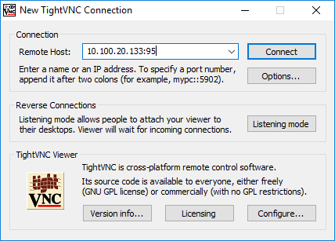
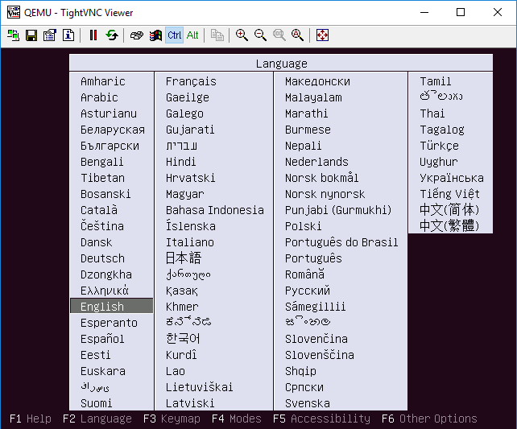
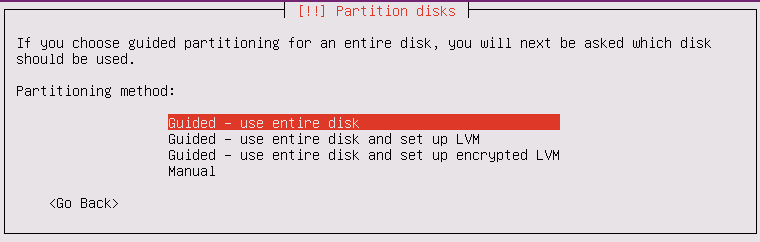
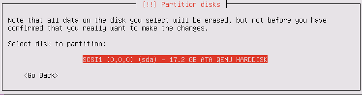
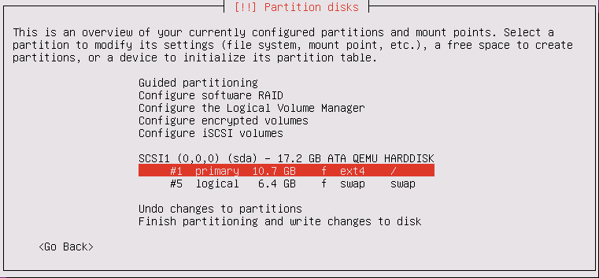
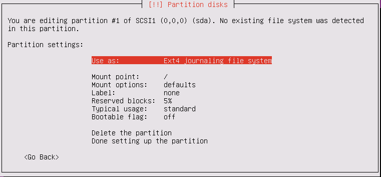
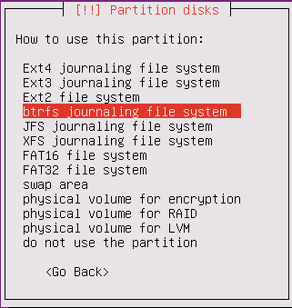
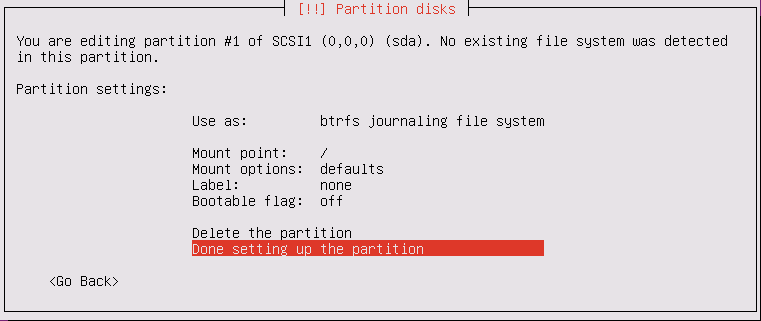
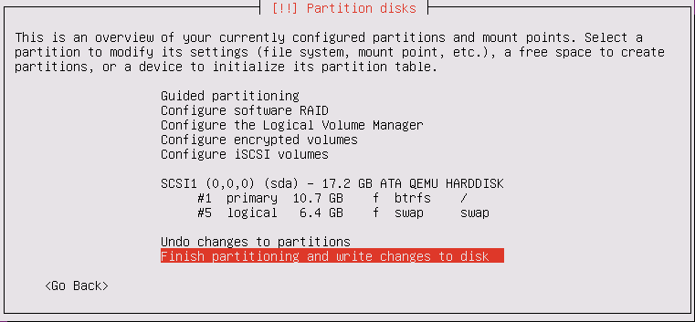
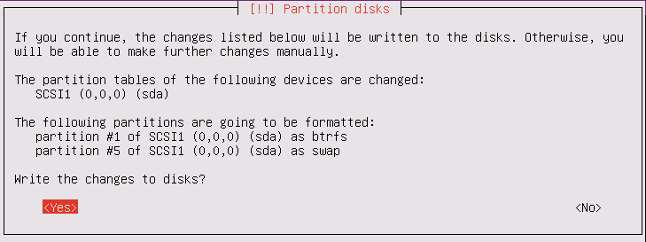

<h1>Tutorial: การใช้ qemu-kvm สร้าง virtual machines บน ubuntu 16.04 server</h1>
<ul>
 <li> <a href="#part1">1. กำหนดให้ ubuntu 16.04 host สนับสนุนการทำงานแบบ nested virtualization</a>
 <li> <a href="#part2">2. สร้าง virtual hard disk ด้วย qemu-img</a> 
      <ul>
       <li> <a href="#part2-1">2.1 disk format แบบ raw</a>
       <li> <a href="#part2-2">2.2 disk format แบบ qcow2</a>
      </ul>
<li> <a href="#part3">3 การติดตั้ง Guest OS แบบ ubuntu 16.04 บน virtual disks</a> 
      <ul>
       <li> <a href="#part3-1">3.1 การใช้ vnc console</a>
       <li> <a href="#part3-2">3.2 แนะนำ qemu monitor</a>
       <li> <a href="#part3-3">3.3 ติดตั้ง guest OS แบบ btrfs file system บน raw disk</a>
       <li> <a href="#part3-4">3.4 รัน vm หลังจากการติดตั้ง</a>
       <li> <a href="#part3-5">3.5 สร้าง disk แบบ qcow2 overlay</a>
      </ul>
</ul>

ใน Tutorial นี้เราสมมุติว่า นศ มีเครื่องจริงหรือ host computer (เราจะกำหนดให้มี IP เป็น 10.100.20.133 ใน tutorial นี้) และสมมุติว่า นศ ต้องการจะติดตั้งและใช้ kvm เพื่อสร้าง virtual machine (vm) ที่มี Guest OS เป็น ubuntu 16.04  

Guide line ในการอ่าน tutorial นี้มีดังนี้ 
<ul>
<li>ในกรณีที่ นศ ต้องการให้ vm ที่ นศ สร้างขึ้นบนเครื่อง host สามารถรัน kvm ได้อีกชั้นหนึ่ง (nested virtualization) ขอให้ นศ อ่านวิธีการกำหนดค่าบนเครื่อง host ในส่วนที่ 1 มิเช่นนั้น ถ้า นศ ไม่ได้ต้องการ feature ดังกล่าวก็ข้ามไปดูส่วนที่ 2 ได้เลย  
<li>ในส่วนที่ 3.3 นศ ต้องเลือกว่าจะติดตั้ง guest OS บน vm โดยใช้ ext4 หรือ btrfs เราจะไม่พูดถึงการติดตั้งแบบ ext เพราะเป็น default ของ ubuntu 16.04 แต่ tutorial นี้จะกล่าวถึงการติดตั้งแบบ btrfs และการสร้างและใช้งาน btrfs snapshot เบื้องต้น ถ้า นศ ไม่ได้จะใช้ btrfs ก็ให้ข้ามส่วนนี้ไป
</ul>

<a id="part1"><h2>1. กำหนดให้ ubuntu 16.04 host สนับสนุนการทำงานแบบ nested virtualization</h2></a>

ก่อนอื่นเรา assume ว่าเครื่อง host server ของ นศ มี hardware virtualization support สำหรับ kvm นศ สามารถเช็คได้ด้วยคำสั่ง 
<pre>
$ sudo su
# egrep --color="auto" "vmx|svm" /proc/cpuinfo
... vmx ... (เครื่อง intel cpu)
#
</pre>

เมื่อ นศ ต้องการรัน VM ภายใน VM อีกชั้นหนึ่ง นศ จะต้องกำหนดค่าดังต่อไปนี้

<pre>
$ sudo su
# cat /sys/module/kvm_intel/parameters/nested 
N
# echo 'options kvm_intel nested=1' >> /etc/modprobe.d/qemu-system-x86.conf 
#
</pre>
หลังจากนั้นให้ reboot เครื่อง host 

ให้ login เข้าเครื่อง host อีกครั้งหนึ่งและเช็คว่าไฟล์ /sys/module/kvm_intel/parameters/nested มีค่า Y หรือไม่

<pre>
$ sudo su
# cat /sys/module/kvm_intel/parameters/nested
Y
#
</pre>

หลังจากนั้น เมื่อ นศ รัน kvm ด้วยคำสั่ง qemu-system-x86_64 จาก command line (เรา assume ว่ามี qemu-kvm software ติดตั้งอยู่บน host แล้ว) ให้กำหนด option "-cpu host" เครื่อง VM ที่ นศ รันด้วย option นี้ก็จะสามารถรัน kvm ได้อีกชั้นหนึ่ง สมมุติว่า นศ รัน qemu-kvm ด้วยคำสั่ง
<pre>
$ sudo qemu-system-x86_64 ... -cpu host ...
</pre>
เมื่อ นศ login เข้าสู่เครื่อง VM นั้น สมมุติว่าเป็น ubuntu เหมือนกัน นศ สามารถตรวจสอบได้ว่า cpu ของเครื่อง VM ของ นศ มี hardware virtualization support หรือไม่ด้วยคำสั่ง

<pre>
# egrep --color="auto" "vmx|svm" /proc/cpuinfo
</pre>

ซึ่งควรจะเห็น บรรทัดที่มีคำว่า vmx หรือ svm

 <a id="part2"><h2>2. สร้าง virtual hard disk ด้วย qemu-img</h2></a>

<table>
<tr><td>
<b>สำหรับวิชา คพ. 449:</b> นศ แต่ละคนจะสร้าง virtual disk แบบ raw ขนาด 4G เพื่อประหยัดพื้นที่ disk บน host server  
</td></tr>
</table>

  <a id="part2-1"><h3>2.1 disk format แบบ raw</h3></a>

เราจะทดลองสร้าง disk image แบบต่างๆ แต่ก่อนอื่นเราต้องสร้าง disk เพื่อติดตั้ง guest OS ของ VM ในคำสั่งถัดไป นศ จะสร้าง disk image แบบ raw 

disk แบบ raw นี้ มีค่าใช้จ่ายคือมันจะใช้พื้นที่บน disk จริงเท่ากับปริมาณที่ นศ ขอไม่ว่า นศ จะใช้พื้นที่เก็บข้อมูลจริงเท่าไร แต่มีข้อดีอ่านเขียนข้อมูลได้เร็ว

<pre>
$ cd $HOME
$ mkdir runQemu
$ cd runQemu
$ mkdir runQemu-img 
$ cd runQemu-img
$ wget http://releases.ubuntu.com/16.04/ubuntu-16.04.3-server-amd64.iso
$ ls
$ <b>qemu-img create -f raw ubuntu1604raw.img 4G</b>
Formatting 'ubuntu1604raw.img', fmt=raw size=4294967296
$ ls -l
total 844804
-rw-rw-r-- 1 kasidit kasidit   865075200 Sep 20 15:55 ubuntu-16.04.3-server-amd64.iso
<b>-rw-r--r-- 1 kasidit kasidit 4294967296 Nov 16 15:38 ubuntu1604raw.img</b>
$
</pre>

  <a id="part2-2"><h3>2.2 disk format แบบ qcow2</h3></a>
ถ้าผมสร้าง image แบบ qemu's copy on write (qcow2) ซึ่ง qemu-kvm จะเขียนข้อมูลลงสู่ disk จริงก็ต่อเมือมีการเพิ่มข้อมูลหรือ modify ข้อมูลเท่านั้น นศ จะเห็นว่าขนาดของ qcow2 disk เริ่มต้นจะไม่ใหญ่มากแต่จะขยายมากขึ้นเมื่อมีการเขียนข้อมูลสู่ disk จริง ข้อดีของ disk แบบ raw คือ performance 
ในขณะที่ข้อดีของแบบ qcow2 คือใช้พื้นที่เท่าที่ใช้จริง

<pre>
$ <b>qemu-img create -f qcow2 ubuntu1604qcow2.img 16G</b>
Formatting 'ubuntu1604qcow2.img', fmt=qcow2 size=17179869184 encryption=off cluster_size=65536 lazy_refcounts=off refcount_bits=16
$ ls -l
total 845000
-rw-rw-r-- 1 kasidit kasidit   865075200 Sep 20 15:55 ubuntu-16.04.3-server-amd64.iso
<b>-rw-r--r-- 1 kasidit kasidit      196864 Nov 16 15:49 ubuntu1604qcow2.img</b>
-rw-r--r-- 1 kasidit kasidit  4294967296 Nov 16 15:38 ubuntu1604raw.img
$
</pre>
disk แบบ qcow2 มี features ที่เราจะกล่าวถึงอีกประการคือแบบการสร้าง virtual disk แบบ qcow2 overlay ซึ่งผมจะอธิบายอีกทีหลังจากส่วนที่ 3 

  <a id="part3"><h2>3 การติดตั้ง Guest OS แบบ ubuntu 16.04 บน virtual disks</h3></a>

ในส่วนนี้ นศ จะเรียก kvm จาก command line เพื่อสร้าง Guest OS บน disk image เปล่าๆ ที่สร้างขึ้น เพื่อความสะดวกผมเขียนคำสั่งลงใน bash shell script 
<table>
<tr><td>
<b>สำหรับวิชา คพ. 449:</b> ขอให้ นศ เปลี่ยน -vnc :NN  และ -monitor tcp:NNNN ให้ NN และ NNNN เป็นเลขเฉพาะของแต่ละคน
</td></tr>
</table>
<pre>
$ cd $HOME/runQemu
$ mkdir runQemu-scripts
$ cd runQemu-scripts
$ vi <a href="runQemu-scripts/runQemu-on-base-img-cdrom.sh">runQemu-on-base-img-cdrom.sh</a>
$ cat runQemu-on-base-img-cdrom.sh
#!/bin/bash
numsmp="4"
memsize="4G"
imgloc=${HOME}/"runQemu"/"runQemu-imgs"
isoloc=${HOME}/"runQemu"/"runQemu-imgs"
imgfile="ubuntu1604raw.img"
exeloc="/usr/local/bin"
CPU_LIST="0-11"
TASKSET="taskset -c ${CPU_LIST}"
#
sudo ${TASKSET} ${exeloc}/qemu-system-x86_64 -enable-kvm -cpu host -smp ${numsmp} \
     -m ${memsize} -drive file=${imgloc}/${imgfile},format=raw \
     -boot d -cdrom ${isoloc}/ubuntu-16.04.3-server-amd64.iso \
     -vnc :95 \
     -net nic -net user \
     -monitor tcp::9666,server,nowait \
     -localtime
$
</pre>
นศ สามารถแทนค่า shell variable ในคำสั่งด้วยตนเองถ้าต้องการออกคำสั่งรัน kvm (qemu-system-x86_64) ด้วยตนเอง สำหรับ script ข้างต้น พารามีเตอร์ที่กำหนดใช้กับคำสั่ง qemu-system-x86_64 ใน script มีความหมายดังนี้
<ul>
 <li> "-enable-kvm" : เรียก qemu ใน mode "kvm" คือให้ qemu ใช้ kvm driver บน linux เพื่อใช้ CPU virtualization supports
 <li> "-cpu host" : ให้ใช้ features ของ CPU ชอง host 
 <li> "-smp 4" : ให้ vm มี virtual cpu cores จำนวน 8 cores (qemu จะสร้าง threads  ขึ้น 8 threads เพื่อรองรับการประมวลผลของ vm)
 <li> "-m 4G" : vm มี memory 4 GiB
 <li> "-drive file..." : vm ใช้ไฟล์ ub1604raw.img เป็น harddisk drive ที่ 1 ผู้ใช้ต้องระบุว่าไฟล์เป็นแบบ raw format เพราะ qemu ต้องการ make sure ว่าผู้ใช้รู้จัวว่ากำลังใช้ raw format image อยู่ (ถ้าไม่ระบุ qemu จะเตือน) ในกรณีที่ นศ ใช้ qcow2 ก็ให้เปลี่ยน format=raw เป็น format=qcow2
 <li> "-boot d" : boot จาก cdrom
 <li> "-cdrom <file...>" : ไฟล์ iso ถ้าจะใช้ cdrom drive จริงต้องระบุ device (ขอให้ดูคู่มือ qemu)
 <li> "-vnc :95" : vm จะรัน vnc server เป็น console ที่ vnc port 95 (port จริง 5900+95)
 <li> "-net nic -net user" : กำหนดให้ network interface ที่ 1 ของ vm ใช้ NAT network
 <li> "-monitor tcp::9666..." : ให้ผู้ใช้เข้า qemu monitor ได้ที่ port 9666 บนเครื่อง localhost
 <li> "-localtime" : กำหนดให้ vm ใช้เวลาเดียวกับเครื่อง host 
</ul>
ขอให้ นศ สังเกตุว่า script นี้้จะรันคำสั่ง qemu-system-x86_64 ด้วย sudo 

สำหรับคำสั่ง taskset และตัวแปร CPULIST นั้นเราไม่ได้บังคับให้ใส่ แต่ที่ใส่ในที่นี้เพื่อกำหนดให้ qemu-kvm process (หรือ threads) สามารถรันบน CPU 0 ถึง 11 ของเครื่อง host (เนื่องจาก host อาจแบ่ง cpu อื่นที่มีสำหรับรันงานอื่น)

ต่อไปให้ นศ รัน script ด้วยคำสั่ง 
<pre>
$ ./runQemu-on-base-img-cdrom.sh &
$
</pre>

<a id="part3-1"><h3>3.1 การใช้ vnc console</h3></a>

ขอให้ นศ ติดตั้ง vnc client บนเครื่อง client computer ที่ นศ ใช้และกำหนด IP address ของเครื่อง host server (ในตัวอย่างของเราคือ 10.100.20.133) และ vnc port (จากที่กำหนดใน option "-vnc" ในตัวอย่างคือ 95) ดังภาพที่ 1 หลังจากกด connect แล้ว นศ จะเห็น vnc console ดังภาพที่ 2

    

ภาพที่ 1

    

ภาพที่ 2

<a id="part3-1"><h3>3.2 แนะนำ qemu monitor</h3></a>

qemu monitor เป็น monitoring console ของ qemu ที่ใช้รอรับคำสั่งจากผู้ใช้ทาง keyboard เพื่อจัดการ vm เช่น ปิดเครื่อง สอบถามสถานะการทำงานและสถิติต่างๆ สั่งให้เครื่อง migrate หรือย้ายไปยังเครื่องอื่น และทำ snapshot ของ CPU และ Memory State เป็นต้น ปกติแล้ว ถ้า นศ <b>ไม่ได้</b>ระบุ option "-monitor tcp::9666..." นศ สามารถเข้าถึง qemu monitor ได้โดย กดปุ่ม ctrl-alt-2 บน vnc colnsole และ กดปุ่ม ctrl-alt-1 เพื่อเปลี่ยนหน้าจอกลับไปยัง console แต่เนื่องจาก นศ ได้ใช้ option ดังกล่าวแล้ว ก็จะใช้ ctrl-alt-2 บน vnc clnsole ไม่ได้ console จะแจ้งว่า "serial0 console" นศ ต้องใช้ nc utility บน bash command line บนเครื่อง host ของ นศ แทน (ในตัวอย่างนี้คือเครื่อง 10.100.20.133) 

<pre>
$ nc localhost 9666
QEMU 2.9.0 monitor - type 'help' for more information
(qemu) help
...
(qemu) info
...
(qemu) กด ctrl-C เพื่อออก
$
</pre>
promt sign ของ qemu monitor คือ (qemu) ถ้า นศ กด help และ info จะมีข้อมูลมากมายแสดงคำสั่งต่างๆซึ่งเราจะยังไม่กล่าวถึงในที่นี่ นศ สามารถศึกษาเพิ่มเติมได้จาก wiki ของ qemu เมื่อต้องการออกจาก monitor กลับมาที่ bash shell ให้กด ctrl C

<a id="part3-1"><h3>3.3 ติดตั้ง guest OS แบบ btrfs file system บน raw disk</h3></a>

ในอับดับถัดไป ขอให้ นศ กลับไปพิจารณา vnc console และติดตั้ง ubuntu 16.04 server ถ้า นศ ต้องการติดตั้งแบบกำหนดให้ vm ใช้ ext4 file system ก็ทำได้เลยโดยเลือกการ partition และ format disk ตาม default ของ ubuntu

แต่ถ้า นศ ต้องการใช้ btrfs file system นศ สามารถทำได้ดังนี้ 
<ul>
<li>

ภาพ setup btrfs ที่ 1 
 
  

    

<li>

ภาพ setup btrfs ที่ 2
 
  

    

<li>

ภาพ setup btrfs ที่ 3
 
  

    

<li>

ภาพ setup btrfs ที่ 4
 
  

    

<li>

ภาพ setup btrfs ที่ 5
 
  

    

<li>

ภาพ setup btrfs ที่ 6
 
  

    

<li>

ภาพ setup btrfs ที่ 7
 
  

    

<li>

ภาพ setup btrfs ที่ 8
 
  

    

</ul>
หลังจากนั้นให้ นศ ติดตั้ง ubuntu ต่อตามปกติ 

Click เพื่อศึกษาการสร้าง btrfs snapshot และ recover snashot

 

เมื่อติดตั้งเสร็จแล้ว ให้ นศ login เข้าสู่เครื่องนั้นและดู btrfs subvolume ที่มีอยู่ในเครื่อง host ซึ่งหลังจากการติดตั้งข้างต้น ubuntu 16.04 จะสร้าง btrfs subvolmes สำหรับ / และ /home directory ให้ตั้งแต่เริ่มต้น
<pre>
$ sudo su
# df -h
Filesystem      Size  Used Avail Use% Mounted on
udev            2.0G     0  2.0G   0% /dev
tmpfs           396M  5.5M  390M   2% /run
/dev/sda1        10G  2.0G  6.3G  25% /
tmpfs           2.0G     0  2.0G   0% /dev/shm
tmpfs           5.0M     0  5.0M   0% /run/lock
tmpfs           2.0G     0  2.0G   0% /sys/fs/cgroup
/dev/sda1        10G  2.0G  6.3G  25% /home
tmpfs           396M     0  396M   0% /run/user/1000
# 
# mount /dev/sda1 /mnt 
#
</pre>
นศ ควร modify ไฟล์ /etc/fstab ด้วยการเพิ่มบรรทัดข้างล่าง เพื่อให้มีการสร้าง /mnt directory และ mount เข้ากับ /dev/sda1 device โดยอัตโนมัติเมื่อมีการ reboot

<pre>
# vi /etc/fstab
...
/dev/sda1       /mnt            btrfs   defaults   0    1
...
(ให้เซฟไฟล์ และออกจาก vi)
#
</pre>
ในอันดับถัดไป นศ list btrfs subvolume ซึ่ง ubuntu จะสร้าง subvolume /mnt/@ สำหรับ / directory และ /mnt/@home สำหรับ /home directory

<pre>
# btrfs subvolume list /mnt
ID 261 gen 7810 top level 5 path @
ID 262 gen 7702 top level 5 path @home
#
</pre>
นศ สามารถทำ defragmentation ด้วยคำสั่งต่อไปนี้

<pre>
# btrfs filesystem defrag /mnt
</pre>
นศ สามารถทำ snapshot ของ /mnt/@ และ /mnt/@home ดังนี้

<pre>
# <b>btrfs subvolume snapshot /mnt/@ /mnt/@_snapshot1</b>
Create a snapshot of '/mnt/@' in '/mnt/@_snapshot1'
# <b>btrfs subvolume snapshot /mnt/@home /mnt/@home_snapshot1</b>
Create a snapshot of '/mnt/@home' in '/mnt/@home_snapshot1'
# btrfs subvolume list /mnt
ID 261 gen 7812 top level 5 path @
ID 262 gen 7813 top level 5 path @home
ID 264 gen 7812 top level 5 path @_snapshot1
ID 265 gen 7813 top level 5 path @home_snapshot1
#
</pre>
หลังจากนั้น ถ้า นศ ติดตั้ง openstack แล้วเกิดความผืดพลาดขึ้น นศ สามารถกู้คืน / และ /home ด้วยคำสั่งต่อไปนี้ 

<pre>
# mv /mnt/@ /mnt/@_badroot
# mv /mnt/@home /mnt/@_badhome
# mv /mnt/@_snapshot1 /mnt/@
# mv /mnt/@home_snapshot1 /mnt/@home
#
# reboot
</pre>
เมื่อ reboot เสร็จ ให้ login เข้าเครื่อง sudo เป็น root แล้ว ลบ /mnt/@_badroot และ /mnt/@_badhome

<pre>
# btrfs subvolume delete /mnt/@_badroot
# btrfs subvolume delete /mnt/@_badhome
</pre>
หลังจากนั้นให้สร้าง snapshot ของ /mnt/@ และ /mnt/@home อีกครั้งหนึ่ง

<pre>
# btrfs subvolume snapshot /mnt/@ /mnt/@_snapshot1
# btrfs subvolume snapshot /mnt/@home /mnt/@home_snapshot1
# btrfs filesystem defrag /mnt
</pre>
ผม recommend ให้ นศ ทำ snapshot ของ /mnt/@ และ /mnt/@home เมื่อผ่านการติดตั้งที่สำคัญๆ เผื่อว่าการติดตั้งในอนาคตผิดพลาด นศ จะได้ recover snapshot ล่าสุดได้ (นศ สามารถดูการสร้าง btrfs snapshot และการใช้งานได้ที่ <a href="https://www.youtube.com/playlist?list=PLmUxMbTCUhr57iyWg8UAZsEXQ9_lX3Ca5">youtube playlist นี้</a>)

หลังจากติดตั้งเสร็จ vm จะ reboot และกลับไปที่หน้าจอเริ่มต้นการติดตั้งใหม่ ให้ นศ ใช้คำสั่ง "quit" ใข qemu monitor เพื่อปิดเครื่อง vm

<pre>
$ nc localhost 9666
QEMU 2.9.0 monitor - type 'help' for more information
(qemu) quit
quit
$
[1]+  Done                    ./runQemu-on-base-img-cdrom.sh  (wd: ~/runQemu-temp/runQemu-scripts)
$
</pre>

<a id="part3-3"><h3>3.4 รัน vm หลังจากการติดตั้ง</h3></a>

<pre>
$ cd $HOME/runQemu/runQemu-scripts
$ vi <a href="runQemu-scripts/runQemu-on-base-img.sh">runQemu-on-base-img.sh</a>
$ cat runQemu-on-base-img.sh
#!/bin/bash
numsmp="4"
memsize="4G"
imgloc=${HOME}/"runQemu"/"runQemu-imgs"
isoloc=${HOME}/"runQemu"/"runQemu-imgs"
imgfile="ubuntu1604raw.img"
exeloc="/usr/local/bin"
CPU_LIST="0-7"
TASKSET="taskset -c ${CPU_LIST}"
#
sudo ${TASKSET} ${exeloc}/qemu-system-x86_64 -enable-kvm -cpu host -smp ${numsmp} \
     -m ${memsize} -L pc-bios -drive file=${imgloc}/${imgfile},format=raw \
     <b>-boot c</b> \
     -vnc :95 \
     -net nic -net user \
     -monitor tcp::9666,server,nowait \
     -localtime
$
</pre>
ขอให้ นศ สังเกตุว่า "-boot c" หมายถึง boot vm จาก hard disk image แทนที่จะเป็นจาก cdrom

 หลังจากนั้นให้ นศ รัน qemu-kvm ขึ้นมาใหม่ด้วยคำสั่งข้างล่าง 
<pre>
$ ./runQemu-on-base-img.sh &
$
</pre>
นศ สามารถเข้าใช้งาน vm ได้ทาง vnc endpoint ตัวอย่างของเราคือ 10.100.20.133:95

<table>
<tr><td>
<b>หมายเหตุ:</b> ที่ผ่านมา ผมเขียนคำสั่งต่างๆใน shell script เพื่อนำกลับมาเรียกใช้ใหม่ได้ แต่เพื่อความสะดวกผมจะเปลี่ยนเป็นใช้คำสั่งโดยตรงในส่วนที่เหลือของ tutorial นี้
</td></tr>
<tr><td>
<b>ยกตัวอย่างเช่น:</b> ที่ผ่านมา คำสั่งที่ติดตั้ง ubuntu 16.04 บน guest OS บน raw image ก่อนหน้า ผมจะเขียนใหม่เป็น
<pre>
$ sudo qemu-system-x86_64 -enable-kvm -cpu host -smp 2 -m 2G \
  -drive file=ubuntu1604raw.img,format=raw -boot d -cdrom ubuntu-16.04.3-server-amd64.iso \
  -vnc :95 -net nic -net user -monitor tcp::9666,server,nowait -localtime &
$
</pre>
</td></tr>
</table>

<a id="part3-4"><h3>3.5 สร้าง disk แบบ qcow2 overlay</h3></a>

จากคำสั่งที่แล้ว ผมได้ติดตั้ง ubuntu 16.04 บน image ubuntu1604raw.img ในอันดับถัดไป ผมจะสร้าง image ชนิด qcow2 แบบที่เรียกว่า overlay image ซึ่งเป็นไฟล์ที่แตกต่างจากแบบ raw และ qcow2 ธรรมดา ก็คือมันเป็นไฟล์ที่เก็บส่วนต่างของ image ที่เป็น base ของมัน ในคำสั่งถัดไป ผมจะสร้าง overlay image ชื่อว่า ubuntu1604qcow2.ovl ขึ้นมา

<pre>
$ qemu-img create -f qcow2 -b ubuntu1604raw.img ubuntu1604qcow2.ovl
Formatting 'ubuntu1604qcow2.ovl', fmt=qcow2 size=4294967296 backing_file=ubuntu1604raw.img encryption=off cluster_size=65536 lazy_refcounts=off refcount_bits=16
$
</pre>
จากคำสั่งข้างต้นไฟล์ ubuntu1604qcow2.ovl มี base image คือไฟล์ ubuntu1604raw.img นั่นหมายความว่า <b>กรณีที่ 1</b> เมื่อ kvm หรือ qemu อ่านค่าจากไฟล์ ubuntu1604qcow2.ovl และข้อมูล block ที่ต้องการยังไม่ได้รับการแก้ไขใดๆ ข้อมูลใน block เดียวกันจากไฟล์ base image ก็ถูกอ่านไปใช้งาน <b>กรณีที่ 2</b> kvm เขียนหรือแก้ไขข้อมูลใน block ของ ubuntu1604qcow2.ovl ที่ไม่เคยมีการเขียนหรือแก้ไขข้อมูลมาก่อน driver ของไฟล์แบบ qcow2 overlay นี้จะ copy ข้อมูลที่มีอยู่แล้วทั้ง block จากไฟล์ base image มายัง ubuntu1604qcow2.ovl หรือไฟล์ overlay และทำการเขียนข้อมูลลงใน copy ใหม่นั้น <b>กรณีที่ 3</b> ถ้า block ที่จะอ่านหรือแก้ไขข้อมูลมี copy อยู่ในไฟล์ overlay แล้ว kvm จะอ่านข้อมูลจาก copy นั้นหรือเขียนข้อมูลลงใน copy นั้นทันที

ประโยชน์ของไฟล์แบบ overlay คือ ทำให้เราสามารถเก็บข้อมูลที่ไม่ต้องการให้ถูกเปลี่ยนแปลงใน base image ได้ นศ สามารถสร้าง overlay ซ้อนกันหลายชั้นก็ได้ แต่ยิ่งจำนวนชั้นมากประสิทธิภาพของการอ่านข้อมูลก็จะช้าลงเพราะอาจต้องเปิดไฟล์หลายไฟล์ 

คำสั่งถัดไปจะเป็นการรัน kvm บนไฟล์ over lay ubuntu1604qcow2.ovl ขอให้สังเกตุขนาดที่เปลี่ยนไปของไฟล์นี้ และขนาดของไฟล์ที่คงเดิมของ ubuntu1604raw.img
<pre>
</pre>

  

