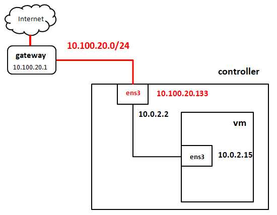
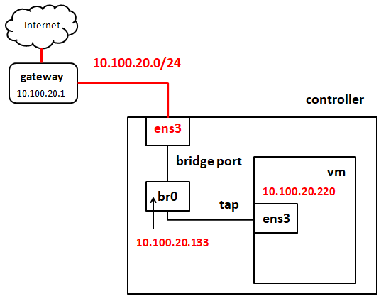
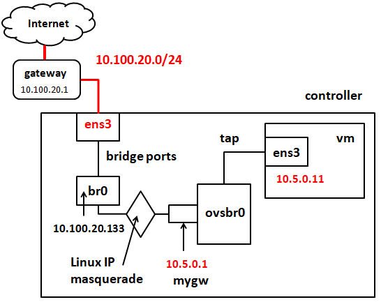

<h1>Tutorial: การใช้ qemu-kvm สร้าง virtual machines บน ubuntu 16.04 server</h1>
<ul>
 <li> <a href="#part0">1. ติดตั้ง qemu-kvm บน host server </a>
 <li> <a href="#part2">2. สร้าง virtual hard disk ด้วย qemu-img</a> 
      <ul>
       <li> <a href="#part2-2">2.1 disk format แบบ raw</a>
       <li> <a href="#part2-1">2.2 disk format แบบ qcow2</a>
      </ul>
<li> <a href="#part3">3 การติดตั้ง Guest OS แบบ ubuntu 16.04 บน virtual disks</a> 
      <ul>
       <li> <a href="#part3-1">3.1 การใช้ vnc console</a>
       <li> <a href="#part3-2">3.2 แนะนำ qemu monitor</a>
       <li> <a href="#part3-3">3.3 ติดตั้ง guest OS แบบ btrfs file system บน raw disk</a>
       <li> <a href="#part3-4">3.4 รัน vm หลังจากการติดตั้ง และใช้ NAT network</a>
       <li> <a href="#part3-5">3.5 สร้าง disk แบบ qcow2 overlay</a>
      </ul>
<li> <a href="#part4">4. การเชื่อมต่อ kvm เข้ากับ L2 Network ด้วย Linux Bridge</a>
      <ul>
       <li> <a href="#part4-1">4.1 ติดตั้ง bridge-utils และกำหนดค่า bridge br0 บน host</a>
       <li> <a href="#part4-2">4.2 กำหนดให้ kvm เชือมต่อกับ bridge br0 และรัน kvm</a>
      </ul>
<li> <a href="#part3">5. การเชื่อมต่อ kvm เข้ากับ subnet ใหม่ ด้วย openvswitch</a> 
<li> <a href="#part4">6. การสร้าง OpenVSwitch Virtual Network</a>
<li> <a href="#part1">7. กำหนดให้ ubuntu 16.04 host สนับสนุนการทำงานแบบ nested virtualization</a>
</ul>

ใน Tutorial นี้เราสมมุติว่า นศ มีเครื่องจริงหรือ host computer (เราจะกำหนดให้มี IP เป็น 10.100.20.151 ใน tutorial นี้) และสมมุติว่า นศ ต้องการจะติดตั้งและใช้ kvm เพื่อสร้าง virtual machine (vm) ที่มี Guest OS เป็น ubuntu 16.04  

Guide line ในการอ่าน tutorial นี้มีดังนี้ 
<ul>
<li>ในกรณีที่ นศ ต้องการให้ vm ที่ นศ สร้างขึ้นบนเครื่อง host สามารถรัน kvm ได้อีกชั้นหนึ่ง (nested virtualization) ขอให้ นศ อ่านวิธีการกำหนดค่าบนเครื่อง host ในส่วนที่ 7  
<li>ในส่วนที่ 3.3 นศ ต้องเลือกว่าจะติดตั้ง guest OS บน vm โดยใช้ ext4 หรือ btrfs การติดตั้งแบบ ext เพราะเป็น default ของ ubuntu 16.04 หาก นศ สนใจที่จะติดตั้ง btrfs บน ubuntu 16.04 และทดลองสร้างและใช้งาน btrfs snapshot เบื้องต้น ก็สามารถอ่านส่วนที่ 3.3 นี้ได้
<li>ใน tutorial นี้ นศ จะรัน qemu-kvm โดยเรียกใช้ qemu-* utilities บน commandlineโดยตรง (ไม่ทำผ่าน libvirt หรือ virsh)  
</ul>

<a id="part0"><h2>1. ติดตั้ง qemu-kvm บน host server</h2></a>

login เข้า server และรัน 
<pre>
$ sudo apt-get update
$ sudo apt-get install qemu-kvm libvirt-bin ubuntu-vm-builder 
$
</pre>

 <a id="part2"><h2>2. สร้าง virtual hard disk image ด้วย qemu-img</h2></a>

<table>
<tr><td>
<b>แบบฝึกหัด:</b> ขอให้ นศ สร้าง virtual disk แบบ qcow2 ขนาด 8G  
</td></tr>
</table>

  <a id="part2-2"><h3>2.1 disk format แบบ qcow2</h3></a>
คำสั่ง qemu-img สร้าง image แบบ copy on write (เรียกว่า qcow2 format) ซึ่งจะสร้าง file เปล่าๆที่ประกอบไปด้วย data structures สำหรับการจัดระเบียบว่าข้อมูลต่างๆที่ถูกเขียนลงบน disk นี้จะถูกเก็บที่ไหนในไฟล์ disk image แต่เมื่อสร้าง file disk image นี้ขึ้นมาจะยังไม่จองพื้นที่จริง แต่จะใช้พื้นที่จริงเมื่อมีการเขียนข้อมูลลงสู่ disk หรือมีการเปลี่ยนแปลงข้อมูลเท่านั้น 

ยกตัวอย่างเช่น เมื่อ นศ สร้าง disk image แบบ qcow2 ขนาด  GB นศ จะเห็นว่าขนาดของ qcow2 disk เริ่มต้นจะไม่ใหญ่มาก (197120 bytes) แต่จะขยายมากขึ้นเมื่อมีการเขียนข้อมูลสู่ disk จริง ข้อดีของ disk แบบนี้คือประหยัดพื้นที่ใช้งาน 

 เพื่อความสะดวกผมจะสร้าง directory ใหม่คือ $HOME/images เพื่อเก็บไฟล์ disk images
<pre>
$ mkdir images
$ cd images
$ qemu-img create -f qcow2 ubuntu1604qcow2.img 8G
Formatting 'ubuntu1604qcow2.img', fmt=qcow2 size=8589934592 encryption=off cluster_size=65536 lazy_refcounts=off refcount_bits=16
$ 
$ ls -l
total 196
-rw-r--r-- 1 openstack openstack 197120 Apr 19 04:03 ubuntu1604qcow2.img
$
</pre>
disk image แบบ qcow2 มี features ที่เราจะกล่าวถึงอีกประการคือการสร้าง disk image แบบ qcow2 overlay ซึ่งผมจะอธิบายอีกทีในภายหลัง 

  <a id="part2-1"><h3>2.2 disk format แบบ raw</h3></a>

virtual disk image แบบ raw นี้ จะใช้พื้นที่บน disk จริงเท่ากับปริมาณที่ขอตั้งแต่แรก มีข้อดีอ่านเขียนข้อมูลได้เร็วแต่มีข้อเสียคือใช้พื้นบน physical disk มาก

<pre>
$ qemu-img create -f raw ubuntu1604raw.img 8G
Formatting 'ubuntu1604raw.img', fmt=raw size=8589934592
$
$ ls -l
total 196
-rw-r--r-- 1 openstack openstack     197120 Apr 19 04:04 ubuntu1604qcow2.img
-rw-r--r-- 1 openstack openstack 8589934592 Apr 19 04:04 ubuntu1604raw.img
$
</pre>

  <a id="part3"><h2>3 การติดตั้ง Guest OS แบบ ubuntu 16.04 บน virtual disks</h2></a>

ในส่วนนี้ นศ จะเรียก qemu-kvm จาก command line เพื่อสร้าง Guest OS บน qcow2 disk image ที่สร้างขึ้น 
ก่อนอื่นผมต้อง download ไฟล์ iso image ของ ubuntu OS มาจากเก็บใน images directory 
<pre>
$ cd $HOME/images
$ wget http://releases.ubuntu.com/16.04/ubuntu-16.04.6-server-amd64.iso
$  
$ ls -l
total 894152
-rw-rw-r-- 1 openstack openstack  915406848 Mar 29 18:14 ubuntu-16.04.6-server-amd64.iso
-rw-r--r-- 1 openstack openstack     197120 Apr 19 04:04 ubuntu1604qcow2.img
-rw-r--r-- 1 openstack openstack 8589934592 Apr 19 04:04 ubuntu1604raw.img
$
</pre>
<table>
<tr><td>
<b>ข้อสังเกตุ:</b> ถ้าในเครื่องของ นศ มีไฟล์นี้อยู่แล้ว ก็ไม่ต้อง wget มาอีก 
</td></tr>

ในอันดับถัดไป ผมจะสร้าง directory ใหม่คือ $HOME/script และใช้ nano หรือ vi เขียนคำสั่งลงใน bash shell script "runQemu-on-base-qcow2-img-cdrom.sh" ใน directory นั้น 
</table>
<pre>
$ cd $HOME
$ mkdir scripts
$ cd scripts
$ nano runQemu-on-base-qcow2-img-cdrom.sh
$ 
$ cat runQemu-on-base-qcow2-img-cdrom.sh
#!/bin/bash
numsmp="2"
memsize="2G"
imgloc=${HOME}/images
isoloc=${HOME}/images
imgfile="ubuntu1604qcow2.img"
exeloc="/usr/local/bin"
#
sudo ${exeloc}/qemu-system-x86_64 \
     -enable-kvm -cpu host -smp ${numsmp} \
     -m ${memsize} \
     -drive file=${imgloc}/${imgfile},format=qcow2 \
     -boot d -cdrom ${isoloc}/ubuntu-16.04.6-server-amd64.iso \
     -vnc :95 \
     -net nic -net user \
     -localtime
$
</pre>
พารามีเตอร์ที่กำหนดใช้กับคำสั่ง qemu-system-x86_64 ใน script มีความหมายดังนี้
<ul>
 <li> "-enable-kvm" : เรียก qemu ใน mode "kvm" คือให้ qemu ใช้ kvm driver บน linux เพื่อใช้ CPU hardware virtualization supports
 <li> "-cpu host" : ให้ใช้ CPU ของเครื่อง host 
 <li> "-smp 2" : ให้ VM เครื่องนี้มี virtual cpu cores จำนวน 2 cores (qemu-kvm จะสร้าง threads  ขึ้น 2 threads เพื่อรองรับการประมวลผลของ VM)
 <li> "-m 2G" : vm มี memory 2 GiB
 <li> "-drive file=${imgloc}/${imgfile},format=qcow2" : VM ใช้ไฟล์ที่กำหนดค่าตัวตัวแปร SHELL VARIABLE ${imgloc}/${imgfile} ซึ่งหมายถึง ${HOME}/images/ubuntu1604qcow2.img เป็น harddisk image ผู้ใช้ต้องระบุว่าไฟล์ format=qcow2 หมายถึงเป็น disk image แบบ qcow2 (ในกรณีที่ นศ ใช้ qcow2 ก็ให้เปลี่ยนเป็น format=raw)
 <li> "-boot d" : boot จาก cdrom
 <li> "-cdrom <file...>" : ไฟล์ iso ถ้าจะใช้ cdrom drive จริงต้องระบุชื่อ device บนเครื่อง host ของ cdrom นั้น
 <li> "-vnc :95" : VM นี้จะรัน vnc server เป็น console ที่ vnc port 95 (port จริง 5900+95)
 <li> "-net nic -net user" : กำหนดให้ network interface ที่ 1 ของ vm ใช้ NAT network
 <li> "-localtime" : กำหนดให้ vm ใช้เวลาเดียวกับเครื่อง host 
</ul>
ขอให้ นศ สังเกตุว่า script นี้้จะรันคำสั่ง qemu-system-x86_64 ด้วย sudo 

ต่อไปให้ นศ รัน script ด้วยคำสั่ง 
<pre>
$ ./runQemu-on-base-img-cdrom.sh &
$
</pre>

<a id="part3-1"><h3>3.1 การใช้ vnc console</h3></a>

ขอให้ นศ ติดตั้ง vnc client บนเครื่อง client computer ที่ นศ ใช้และกำหนด IP address ของเครื่อง host server (ในตัวอย่างของเราคือ 10.100.20.133) และ vnc port (จากที่กำหนดใน option "-vnc" ในตัวอย่างคือ 95) ดังภาพที่ 1 หลังจากกด connect แล้ว นศ จะเห็น vnc console ดังภาพที่ 2

    

ภาพที่ 1

    

ภาพที่ 2

<a id="part3-1"><h3>3.2 แนะนำ qemu monitor</h3></a>

qemu monitor เป็น monitoring console ของ qemu ที่ใช้รอรับคำสั่งจากผู้ใช้ทาง keyboard เพื่อจัดการ vm เช่น ปิดเครื่อง สอบถามสถานะการทำงานและสถิติต่างๆ สั่งให้เครื่อง migrate หรือย้ายไปยังเครื่องอื่น และทำ snapshot ของ CPU และ Memory State เป็นต้น ปกติแล้ว ถ้า นศ <b>ไม่ได้</b>ระบุ option "-monitor tcp::9666..." นศ สามารถเข้าถึง qemu monitor ได้โดย กดปุ่ม ctrl-alt-2 บน vnc colnsole และ กดปุ่ม ctrl-alt-1 เพื่อเปลี่ยนหน้าจอกลับไปยัง console แต่เนื่องจาก นศ ได้ใช้ option ดังกล่าวแล้ว ก็จะใช้ ctrl-alt-2 บน vnc clnsole ไม่ได้ console จะแจ้งว่า "serial0 console" นศ ต้องใช้ nc utility บน bash command line บนเครื่อง host ของ นศ แทน (ในตัวอย่างนี้คือเครื่อง 10.100.20.133) 

<pre>
$ nc localhost 9666
QEMU 2.9.0 monitor - type 'help' for more information
(qemu) help
...
(qemu) info
...
(qemu) กด ctrl-C เพื่อออก
$
</pre>
promt sign ของ qemu monitor คือ (qemu) ถ้า นศ กด help และ info จะมีข้อมูลมากมายแสดงคำสั่งต่างๆซึ่งเราจะยังไม่กล่าวถึงในที่นี่ นศ สามารถศึกษาเพิ่มเติมได้จาก wiki ของ qemu เมื่อต้องการออกจาก monitor กลับมาที่ bash shell ให้กด ctrl C

<a id="part3-1"><h3>3.3 ติดตั้ง guest OS แบบ btrfs file system บน raw disk</h3></a>

ในอับดับถัดไป ขอให้ นศ กลับไปพิจารณา vnc console และติดตั้ง ubuntu 16.04 server ถ้า นศ ต้องการติดตั้งแบบกำหนดให้ vm ใช้ ext4 file system ก็ทำได้เลยโดยเลือกการ partition และ format disk ตาม default ของ ubuntu

แต่ถ้า นศ ต้องการใช้ btrfs file system นศ สามารถทำได้ดังนี้ 
<ul>
<li>

ภาพ setup btrfs ที่ 1 
 
  

    

<li>

ภาพ setup btrfs ที่ 2
 
  

    

<li>

ภาพ setup btrfs ที่ 3
 
  

    

<li>

ภาพ setup btrfs ที่ 4
 
  

    

<li>

ภาพ setup btrfs ที่ 5
 
  

    

<li>

ภาพ setup btrfs ที่ 6
 
  

    

<li>

ภาพ setup btrfs ที่ 7
 
  

    

<li>

ภาพ setup btrfs ที่ 8
 
  

    

</ul>
หลังจากนั้นให้ นศ ติดตั้ง ubuntu ต่อตามปกติ 
<table>
<tr><td>

Click เพื่อศึกษาการสร้าง btrfs snapshot และ recover snashot

 

เมื่อติดตั้งเสร็จแล้ว ให้ นศ login เข้าสู่เครื่องนั้นและดู btrfs subvolume ที่มีอยู่ในเครื่อง host ซึ่งหลังจากการติดตั้งข้างต้น ubuntu 16.04 จะสร้าง btrfs subvolmes สำหรับ / และ /home directory ให้ตั้งแต่เริ่มต้น
<pre>
$ sudo su
# df -h
Filesystem      Size  Used Avail Use% Mounted on
udev            2.0G     0  2.0G   0% /dev
tmpfs           396M  5.5M  390M   2% /run
/dev/sda1        10G  2.0G  6.3G  25% /
tmpfs           2.0G     0  2.0G   0% /dev/shm
tmpfs           5.0M     0  5.0M   0% /run/lock
tmpfs           2.0G     0  2.0G   0% /sys/fs/cgroup
/dev/sda1        10G  2.0G  6.3G  25% /home
tmpfs           396M     0  396M   0% /run/user/1000
# 
# mount /dev/sda1 /mnt 
#
</pre>
นศ ควร modify ไฟล์ /etc/fstab ด้วยการเพิ่มบรรทัดข้างล่าง เพื่อให้มีการสร้าง /mnt directory และ mount เข้ากับ /dev/sda1 device โดยอัตโนมัติเมื่อมีการ reboot

<pre>
# vi /etc/fstab
...
/dev/sda1       /mnt            btrfs   defaults   0    1
...
(ให้เซฟไฟล์ และออกจาก vi)
#
</pre>
ในอันดับถัดไป นศ list btrfs subvolume ซึ่ง ubuntu จะสร้าง subvolume /mnt/@ สำหรับ / directory และ /mnt/@home สำหรับ /home directory

<pre>
# btrfs subvolume list /mnt
ID 261 gen 7810 top level 5 path @
ID 262 gen 7702 top level 5 path @home
#
</pre>
นศ สามารถทำ defragmentation ด้วยคำสั่งต่อไปนี้

<pre>
# btrfs filesystem defrag /mnt
</pre>
นศ สามารถทำ snapshot ของ /mnt/@ และ /mnt/@home ดังนี้

<pre>
# <b>btrfs subvolume snapshot /mnt/@ /mnt/@_snapshot1</b>
Create a snapshot of '/mnt/@' in '/mnt/@_snapshot1'
# <b>btrfs subvolume snapshot /mnt/@home /mnt/@home_snapshot1</b>
Create a snapshot of '/mnt/@home' in '/mnt/@home_snapshot1'
# btrfs subvolume list /mnt
ID 261 gen 7812 top level 5 path @
ID 262 gen 7813 top level 5 path @home
ID 264 gen 7812 top level 5 path @_snapshot1
ID 265 gen 7813 top level 5 path @home_snapshot1
#
</pre>
หลังจากนั้น ถ้า นศ ใช้งาน directory / และ /home แล้วเกิดควาผิดพลาดขึ้น นศ สามารถกู้คืน / และ /home ด้วยคำสั่งต่อไปนี้ 

<pre>
# mv /mnt/@ /mnt/@_badroot
# mv /mnt/@home /mnt/@_badhome
# mv /mnt/@_snapshot1 /mnt/@
# mv /mnt/@home_snapshot1 /mnt/@home
#
# reboot
</pre>
เมื่อ reboot เสร็จ ให้ login เข้าเครื่อง sudo เป็น root แล้ว ลบ /mnt/@_badroot และ /mnt/@_badhome

<pre>
# btrfs subvolume delete /mnt/@_badroot
# btrfs subvolume delete /mnt/@_badhome
</pre>
หลังจากนั้นให้สร้าง snapshot ของ /mnt/@ และ /mnt/@home อีกครั้งหนึ่ง และทำ defragmentation ด้วยคำสั่งต่อไปนี้

<pre>
# btrfs subvolume snapshot /mnt/@ /mnt/@_snapshot1
# btrfs subvolume snapshot /mnt/@home /mnt/@home_snapshot1
# btrfs filesystem defrag /mnt
</pre>
ผม recommend ให้ นศ ทำ snapshot ของ /mnt/@ และ /mnt/@home ในระหว่างที่ใช้งาน file system เป็นระยะๆ (ภายใต้ชื่ที่แตกต่างจาก @_snapshot1 และ @home_snapshot1) เผื่อว่าเกิดความผิดพลาดขึ้น นศ จะได้ recover ข้อมูลจาก snapshots เหล่านั้น ได้ (นศ สามารถดูการสร้าง btrfs snapshot และการใช้งานได้ที่ <a href="https://www.youtube.com/playlist?list=PLmUxMbTCUhr57iyWg8UAZsEXQ9_lX3Ca5">youtube playlist นี้</a>)

</td></tr>
</table>
หลังจากติดตั้งเสร็จ vm จะ reboot และกลับไปที่หน้าจอเริ่มต้นการติดตั้งใหม่ ให้ นศ ใช้คำสั่ง "quit" ใข qemu monitor เพื่อปิดเครื่อง vm

<pre>
$ nc localhost 9666
QEMU 2.9.0 monitor - type 'help' for more information
(qemu) quit
quit
$
[1]+  Done                    ./runQemu-on-base-img-cdrom.sh  (wd: ~/runQemu-temp/runQemu-scripts)
$
</pre>

<a id="part3-3"><h3>3.4 รัน vm หลังจากการติดตั้งและใช้ NAT network</h3></a>

<pre>
$ cd $HOME/runQemu/runQemu-scripts
$ vi <a href="runQemu-scripts/runQemu-on-base-img.sh">runQemu-on-base-img.sh</a>
$ cat runQemu-on-base-img.sh
#!/bin/bash
numsmp="4"
memsize="4G"
imgloc=${HOME}/"runQemu"/"runQemu-imgs"
isoloc=${HOME}/"runQemu"/"runQemu-imgs"
imgfile="ubuntu1604raw.img"
exeloc="/usr/local/bin"
CPU_LIST="0-7"
TASKSET="taskset -c ${CPU_LIST}"
#
sudo ${TASKSET} ${exeloc}/qemu-system-x86_64 -enable-kvm -cpu host -smp ${numsmp} \
     -m ${memsize} -L pc-bios -drive file=${imgloc}/${imgfile},format=raw \
     <b>-boot c</b> \
     -vnc :95 \
     -net nic -net user \
     -monitor tcp::9666,server,nowait \
     -localtime
$
</pre>
ขอให้ นศ สังเกตุว่า "-boot c" หมายถึง boot vm จาก hard disk image แทนที่จะเป็นจาก cdrom

 หลังจากนั้นให้ นศ รัน qemu-kvm ขึ้นมาใหม่ด้วยคำสั่งข้างล่าง 
<pre>
$ ./runQemu-on-base-img.sh &
$
</pre>
นศ สามารถเข้าใช้งาน vm ได้ทาง vnc endpoint ตัวอย่างของเราคือ 10.100.20.133:95

<table>
<tr><td>
<b>หมายเหตุ:</b> ที่ผ่านมา ผมเขียนคำสั่งต่างๆใน shell script เพื่อนำกลับมาเรียกใช้ใหม่ได้ แต่เพื่อความสะดวกผมจะเปลี่ยนเป็นใช้คำสั่งโดยตรงในส่วนที่เหลือของ tutorial นี้
</td></tr>
<tr><td>
<b>ยกตัวอย่างเช่น:</b> ที่ผ่านมา คำสั่งที่ติดตั้ง ubuntu 16.04 บน guest OS บน raw image ก่อนหน้า ผมจะเขียนใหม่เป็น
<pre>
$ sudo qemu-system-x86_64 -enable-kvm -cpu host -smp 2 -m 2G \
  -drive file=ubuntu1604raw.img,format=raw -boot d -cdrom ubuntu-16.04.3-server-amd64.iso \
  -vnc :95 -net nic -net user -monitor tcp::9666,server,nowait -localtime &
$
</pre>
</td></tr>
</table>

สำหรับการติดต่อสื่อสารกับ network เครื่อง vm ที่ นศ เพิ่งรันด้วย option "-net nic -net user" จะมีการเชื่อมต่อกับ network ดังภาพที่ 3 

    
ภาพที่ 3

จากภาพเครื่อง vm เชื่อมต่อกับ host แบบ NAT network ด้วย Slirp protocol และมี subnet ระหว่าง host กับ vm คืออยู่ในวง 10.0.2.0 
โดยที่ host จะมี IP address คือ 10.0.2.2 และ vm จะมี IP address คือ 10.0.2.15 subnet นี้เป็น subnet ภายในที่อยู่ภายใต้ namespace 
เฉพาะ ระหว่าง host กับ vm แต่ละ vm เป็นคู่ๆไปเท่านั้น ด้วยเหตุนี้ นศ จะติดต่อสื่อสารจาก client โปรแกรมภายใน vm ออกสู่โลกภายนอกได้ 
แต่ client โปรแกรมจากภายนอก vm จะไม่สามารถสื่อสารกับโปรแกรม server ภายใน vm ได้ 

<a id="part3-4"><h3>3.5 สร้าง disk แบบ qcow2 overlay</h3></a>

จากคำสั่งที่แล้ว ผมได้ติดตั้ง ubuntu 16.04 บน image ubuntu1604raw.img ในอันดับถัดไป ผมจะสร้าง image ชนิด qcow2 แบบที่เรียกว่า overlay image ซึ่งเป็นไฟล์ที่แตกต่างจากแบบ raw และ qcow2 ธรรมดา ก็คือมันเป็นไฟล์ที่เก็บส่วนต่างของ image ที่เป็น base ของมัน ในคำสั่งถัดไป ผมจะสร้าง overlay image ชื่อว่า ubuntu1604qcow2.ovl ขึ้นมา

<pre>
$ qemu-img create -f qcow2 -b ubuntu1604raw.img ubuntu1604qcow2.ovl
Formatting 'ubuntu1604qcow2.ovl', fmt=qcow2 size=4294967296 backing_file=ubuntu1604raw.img encryption=off cluster_size=65536 lazy_refcounts=off refcount_bits=16
$
</pre>
จากคำสั่งข้างต้นไฟล์ ubuntu1604qcow2.ovl มี base image คือไฟล์ ubuntu1604raw.img นั่นหมายความว่า <b>กรณีที่ 1</b> เมื่อ kvm หรือ qemu อ่านค่าจากไฟล์ ubuntu1604qcow2.ovl และข้อมูล block ที่ต้องการยังไม่ได้รับการแก้ไขใดๆ ข้อมูลใน block เดียวกันจากไฟล์ base image ก็ถูกอ่านไปใช้งาน <b>กรณีที่ 2</b> kvm เขียนหรือแก้ไขข้อมูลใน block ของ ubuntu1604qcow2.ovl ที่ไม่เคยมีการเขียนหรือแก้ไขข้อมูลมาก่อน driver ของไฟล์แบบ qcow2 overlay นี้จะ copy ข้อมูลที่มีอยู่แล้วทั้ง block จากไฟล์ base image มายัง ubuntu1604qcow2.ovl หรือไฟล์ overlay และทำการเขียนข้อมูลลงใน copy ใหม่นั้น <b>กรณีที่ 3</b> ถ้า block ที่จะอ่านหรือแก้ไขข้อมูลมี copy อยู่ในไฟล์ overlay แล้ว kvm จะอ่านข้อมูลจาก copy นั้นหรือเขียนข้อมูลลงใน copy นั้นทันที

ประโยชน์ของไฟล์แบบ overlay คือ ทำให้เราสามารถเก็บข้อมูลที่ไม่ต้องการให้ถูกเปลี่ยนแปลงใน base image ได้ นศ สามารถสร้าง overlay ซ้อนกันหลายชั้นก็ได้ แต่ยิ่งจำนวนชั้นมากประสิทธิภาพของการอ่านข้อมูลก็จะช้าลงเพราะอาจต้องเปิดไฟล์หลายไฟล์ 

คำสั่งถัดไปจะเป็นการรัน kvm บนไฟล์ overlay "ubuntu1604qcow2.ovl" ขอให้สังเกตุขนาดที่เปลี่ยนไปของไฟล์นี้ และขนาดของไฟล์ที่คงเดิมของ ubuntu1604raw.img
<pre>
$ ls -l
-rw-r--r-- 1 cs449user cs449user     197120 Nov 27 17:24 ubuntu1604qcow2.ovl
-rw-r--r-- 1 cs449user cs449user 4294967296 Nov 27 17:13 ubuntu1604raw.img
$
$ sudo qemu-system-x86_64 -enable-kvm -cpu host -smp 2 -m 2G -L pc-bios \
>  -drive file=ubuntu1604qcow2.ovl,format=qcow2 \
>  -boot c -vnc :95 -net nic -net user -monitor tcp::9666,server,nowait -localtime &
[4] 2455
$ 
</pre>
หลังจากนั้นผมใช้ vnc client เข้าไปทำ apt-get update และผม ls -l ใน bash shell ข้างต้นจะเห็นความเปลี่ยนแปลงของไฟล์ ubuntu1604qcow2.ovl 
<pre>
$ la -l
-rw-r--r-- 1 cs449user cs449user   13238272 Nov 27 18:13 ubuntu1604qcow2.ovl
-rw-r--r-- 1 cs449user cs449user 4294967296 Nov 27 17:13 ubuntu1604raw.img
$ 
</pre>
  <b>การ commit การเปลี่ยนแปลง จาก overlay image ไปยัง base image</b> สมมุติว่าหลังจากที่ทำงานเสร็จ ผมพอใจกับเนื้อหาใหม่ใน overlay ไฟล์ และอยาก merge ข้อมูลใหม่ลงสู่ไฟล์ base image ผมสามารถทำได้ดังนี้
<ul>
 <li> ก่อนอื่นเพื่อความปลอดภัยในการใช้งาน image ทั้งสองไฟล์ ผมจะหยุดการทำงานของ vm ก่อน 

<pre>
$ echo "quit" | nc localhost 9666
QEMU 2.5.0 monitor - type 'help' for more information
(qemu) quit
$ 
</pre>
 <li>หลังจากนั้น ผม merge เนื้อหาของ overlay image เข้ากับ base image   
<pre>
$ qemu-img info ubuntu1604qcow2.ovl
image: ubuntu1604qcow2.ovl
file format: qcow2
virtual size: 4.0G (4294967296 bytes)
disk size: 104M
cluster_size: 65536
backing file: ubuntu1604raw.img
Format specific information:
    compat: 1.1
    lazy refcounts: false
    refcount bits: 16
    corrupt: false
$ qemu-img commit ubuntu1604qcow2.ovl
Image committed.
$
</pre>
    <li> ให้ นศ รัน vm อีกครั้งหนึ่งโดยใช้ base raw image เป็น disk image ของ vm และจะเห็นว่าการเปลี่ยนแปลงข้อมูลใน file system ที่ นศ ทำก่อนหน้าได้รับการเขียนลงสู่ไฟล์ raw image แล้ว  
<pre>
$ sudo qemu-system-x86_64 -enable-kvm -cpu host -smp 2 -m 2G -L pc-bios \
>  -drive file=ubuntu1604raw.img,format=raw \
>  -boot c -vnc :95 -net nic -net user -monitor tcp::9666,server,nowait -localtime &
$ 
</pre>
  </ul>

สรุปเนื้อหาในส่วนนี้แสดงวิธีการทำ disk snapshot อีกวิธีหนึ่งด้วยเครื่องมือ overlay image ไฟล์ของ qemu

  <a id="part4"><h2>4. การเชื่อมต่อ kvm เข้ากับ L2 Network ด้วย Linux Bridge</h2></a>

ในกรณีที่ นศ ต้องการให้ vm รันโปรแกรม server เพื่อให้สามารถเข้าถึงได้ผ่าน network และ นศ ต้องการให้ vm มี
IP address ที่อยู่ในวงเดียวกันกับ host นศ สามารถกำหนดให้ vm ใช้ bridge network ซึ่งมีลักษณะการเชื่อมต่อระหว่าง 
vm กับโลกภายนอกดังภาพที่ 4

    
ภาพที่ 4

  <a id="part4-1"><h3>4.1 ติดตั้ง bridge-utils และกำหนดค่า bridge br0 บน host</h3></a>

<pre>
$ sudo apt-get update
$ sudo apt-get install bridge-utils
...
$ cat /etc/network/interfaces
# This file describes the network interfaces available on your system
# and how to activate them. For more information, see interfaces(5).
source /etc/network/interfaces.d/*
auto lo
iface lo inet loopback
auto ens3
iface ens3 inet static
address 10.100.20.133
netmask 255.255.255.0
network 10.100.20.0
gateway 10.100.20.1
dns-nameservers 9.9.9.9
$
</pre>

หลังจากติดตั้ง แล้ว ผมแสดงค่า /etc/network/interfaces ที่มีอยู่แต่เดิม ในอันดับถัดไปผมจะกำหนดค่าในไฟล์ /etc/network/interfaces ใหม่สำหรับ br0 interface ดังนี้ 

<pre>
$ sudo vi /etc/network/interfaces
$
$ cat /etc/network/interfaces
# This file describes the network interfaces available on your system
# and how to activate them. For more information, see interfaces(5).
source /etc/network/interfaces.d/*
auto lo
iface lo inet loopback
auto ens3
iface ens3 inet manual
auto br0
iface br0 inet static
   address 10.100.20.133
   netmask 255.255.255.0
   gateway 10.100.20.1
   bridge_ports    ens3
   bridge_stp      off
   bridge_maxwait  0
   bridge_fd       0
   dns-nameservers 9.9.9.9
$
$ sudo reboot 
</pre>
ถ้า นศ ไม่อยาก reboot นศ สามารถ restart network ด้วยคำสั่ง
<pre>
$ sudo service networking restart 
</pre>

  <a id="part4-2"><h3>4.2 กำหนดให้ kvm เชือมต่อกับ bridge br0 และรัน kvm </h3></a>

นศ ต้องสร้าง script ไฟล์ สองไฟล์ที่ kvm จะเรียกเพื่อสร้าง tap interface เชื่อมต่อกับ bridge br0 ที่เราเพิ่สร้างขึ้น
<pre>
$ mkdir ${HOME}/etc
$
$ vi ${HOME}/etc/qemu-ifup
$ chmod 755 ${HOME}/etc/qemu-ifup
$
$ cat  ${HOME}/etc/qemu-ifup
#!/bin/sh
switch=$(/sbin/ip route list | awk '/^default / { print $5 }')
/sbin/ifconfig $1 0.0.0.0 promisc up
/sbin/brctl addif ${switch} $1
$
$ vi ${HOME}/etc/qemu-ifdown
$ chmod 755 ${HOME}/etc/qemu-ifdown
$
$ cat ${HOME}/etc/qemu-ifdown
#!/bin/sh
switch=$(/sbin/ip route list | awk '/^default / { print $5 }')
/sbin/ifconfig $1 down
/sbin/brctl delif ${switch} $1
$
</pre>
รัน kvm ด้วยคำสั่งนี้ ขอให้สังเกตุ option "upscript" และ "downscript"
<pre>
$ sudo qemu-system-x86_64 -enable-kvm -cpu host -smp 2 \
>  -m 2G -L pc-bios -drive file=ubuntu1604raw.img,format=raw \
>  -boot c -vnc :95 \
>  -netdev type=tap,script=${HOME}/etc/qemu-ifup,downscript=${HOME}/etc/qemu-ifdown,id=hostnet10 \
>  -device virtio-net-pci,romfile=,netdev=hostnet10,mac=00:54:09:25:c1:c7 \
>  -monitor tcp::9003,server,nowait \
>  -localtime &
</pre>
เนื่องจากเรายังไม่ได้ กำหนดค่า IP ของ tap interface ของ vm ที่เพิ่งรันให้อยู่ในวง 10.100.20.x เรายังไม่สามารถ putty เข้าสู่ vm ได้ เราต้องกำหนด network เริ่มต้นโดยใช้ vnc client console ซึ่งสามารถเข้าถึงที่ vnc endpoint 10.100.20.133:95 เมื่อเข้าสู่ vnc console แล้วให้ นศ กำหนดค่าในไฟล์ /etc/network/interfaces ของ vm ดังนี้ แล้ว restart network (หมายเหตุ ผมเปลี่ยน prompt sign ของ vm ให้เป็น "vm$" 

<pre>
vm$ cat /etc/network/interfaces
# This file describes the network interfaces available on your system
# and how to activate them. For more information, see interfaces(5).
source /etc/network/interfaces.d/*
auto lo
iface lo inet loopback
auto ens3
iface ens3 inet static
address 10.100.20.220
netmask 255.255.255.0
network 10.100.20.0
gateway 10.100.20.1
dns-nameservers 9.9.9.9
vm$ 
vm$ sudo service networking restart
vm$
vm$ ping www.google.com
...
vm$
</pre>
นศ จะเห็นว่าขณะนี้ทั้ง host และ vm อยู่ในวง subnet เดียวกันคือวง 10.100.20.0/24

<a id="part5"><h2>5. การเชื่อมต่อ kvm เข้ากับ subnet ใหม่ ด้วย openvswitch</h2></a>

    
ภาพที่ 5

TBA

<a id="part6"><h2>6. การ openvswitch virtual network</h2></a>

<a id="part1"><h2>7. กำหนดให้ ubuntu 16.04 host สนับสนุนการทำงานแบบ nested virtualization</h2></a>

ก่อนอื่นเรา assume ว่าเครื่อง host server ของ นศ มี hardware virtualization support สำหรับ kvm นศ สามารถเช็คได้ด้วยคำสั่ง 
<pre>
$ sudo su
# egrep --color="auto" "vmx|svm" /proc/cpuinfo
... vmx ... (เครื่อง intel cpu)
#
</pre>

เมื่อ นศ ต้องการรัน VM ภายใน VM อีกชั้นหนึ่ง นศ จะต้องกำหนดค่าดังต่อไปนี้

<pre>
$ sudo su
# cat /sys/module/kvm_intel/parameters/nested 
N
# echo 'options kvm_intel nested=1' >> /etc/modprobe.d/qemu-system-x86.conf 
#
</pre>
หลังจากนั้นให้ reboot เครื่อง host 

ให้ login เข้าเครื่อง host อีกครั้งหนึ่งและเช็คว่าไฟล์ /sys/module/kvm_intel/parameters/nested มีค่า Y หรือไม่

<pre>
$ sudo su
# cat /sys/module/kvm_intel/parameters/nested
Y
#
</pre>

หลังจากนั้น เมื่อ นศ รัน kvm ด้วยคำสั่ง qemu-system-x86_64 จาก command line (เรา assume ว่ามี qemu-kvm software ติดตั้งอยู่บน host แล้ว) ให้กำหนด option "-cpu host" เครื่อง VM ที่ นศ รันด้วย option นี้ก็จะสามารถรัน kvm ได้อีกชั้นหนึ่ง สมมุติว่า นศ รัน qemu-kvm ด้วยคำสั่ง
<pre>
$ sudo qemu-system-x86_64 ... -cpu host ...
</pre>
เมื่อ นศ login เข้าสู่เครื่อง VM นั้น สมมุติว่าเป็น ubuntu เหมือนกัน นศ สามารถตรวจสอบได้ว่า cpu ของเครื่อง VM ของ นศ มี hardware virtualization support หรือไม่ด้วยคำสั่ง

<pre>
# egrep --color="auto" "vmx|svm" /proc/cpuinfo
</pre>

ซึ่งควรจะเห็น บรรทัดที่มีคำว่า vmx หรือ svm
