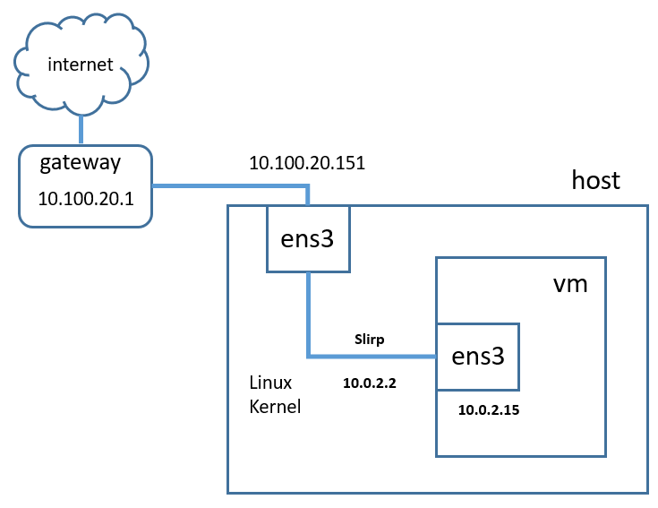
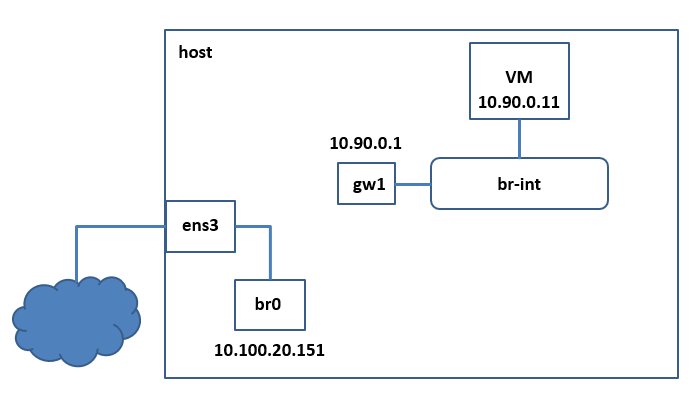
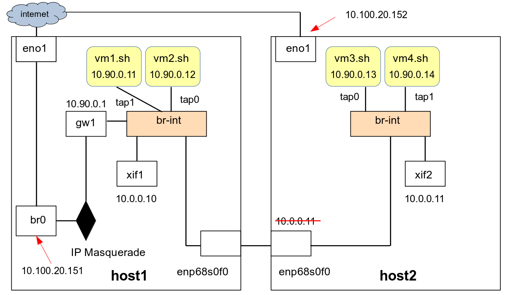
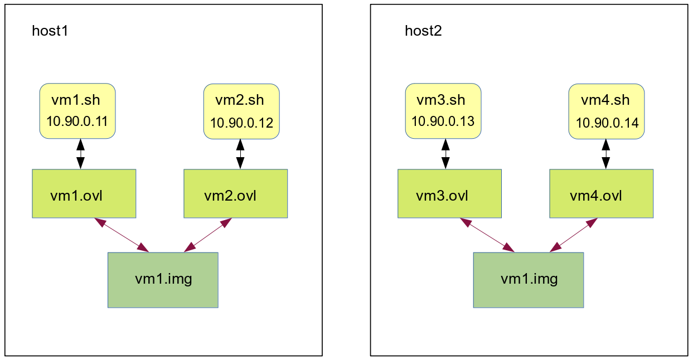
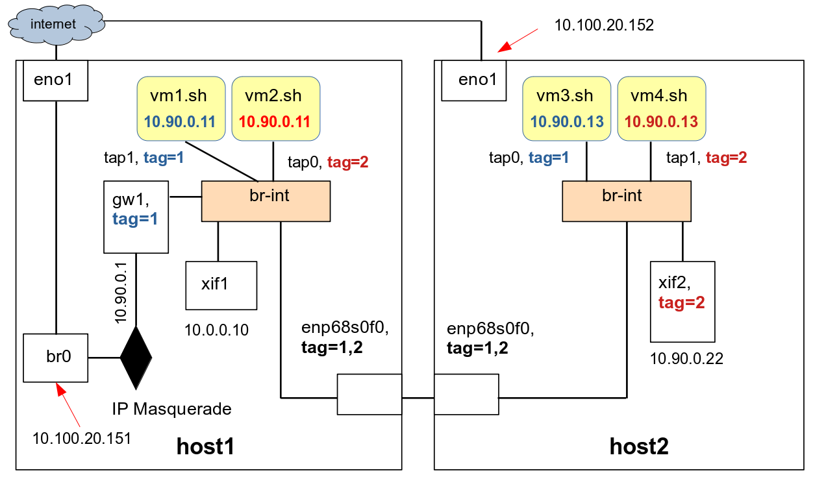
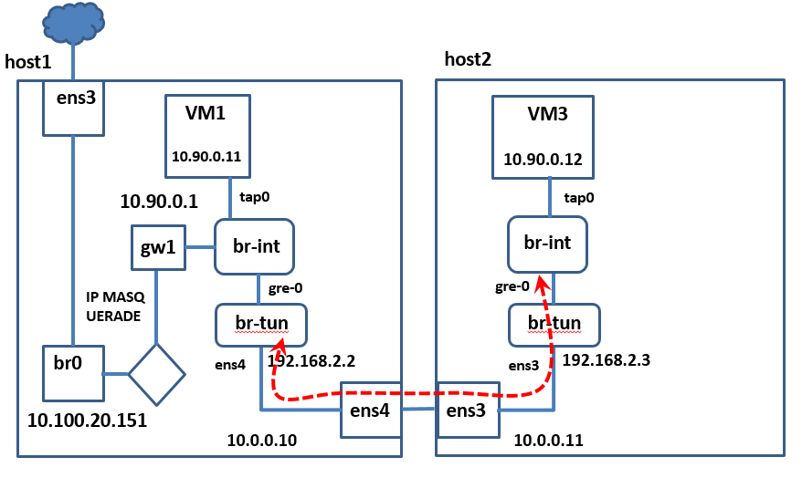

<h1>Tutorial: การใช้ qemu-kvm สร้าง virtual machines บน ubuntu 16.04 server</h1>
<ul>
 <li> <a href="#part1">1. ติดตั้ง qemu-kvm บน host server </a>
       <ul>
       <li> <a href="#part1-1">1.1 ติดตั้งจาก ubuntu repository</a>
       <li> <a href="#part1-2">1.2 compile และติดตั้งจาก source code</a>
      </ul>
 <li> <a href="#part2">2. สร้าง virtual hard disk ด้วย qemu-img</a> 
      <ul>
       <li> <a href="#part2-2">2.1 disk format แบบ raw</a>
       <li> <a href="#part2-1">2.2 disk format แบบ qcow2</a>
      </ul>
<li> <a href="#part3">3 การติดตั้ง Guest OS แบบ ubuntu 16.04 บน virtual disks</a> 
      <ul>
       <li> <a href="#part3-1">3.1 การใช้ vnc console</a>
       <li> <a href="#part3-2">3.2 แนะนำ qemu monitor</a>
       <li> <a href="#part3-3">3.3 ติดตั้ง guest OS แบบ btrfs file system บน raw disk</a>
       <li> <a href="#part3-4">3.4 รัน vm หลังจากการติดตั้ง และใช้ NAT network</a>
       <li> <a href="#part3-5">3.5 สร้าง disk แบบ qcow2 overlay</a>
      </ul>
<li> <a href="#part4">4. การเชื่อมต่อ kvm เข้ากับ L2 Network ด้วย Linux Bridge</a>
      <ul>
       <li> <a href="#part4-1">4.1 ติดตั้ง bridge-utils และกำหนดค่า bridge br0 บน host</a>
       <li> <a href="#part4-2">4.2 กำหนดให้ kvm เชือมต่อกับ bridge br0 และรัน kvm</a>
      </ul>
<li> <a href="#part5">5. การเชื่อมต่อ kvm เข้ากับ L2 Network ด้วย openvswitch</a> 
      <ul>
       <li> <a href="#part5-1">5.1 การเชื่อมต่อ switch สู่ Internet ด้วย IP Masqurade</a>
       <li> <a href="#part5-2">5.2 การเชื่อมต่อ physical host เข้ากับ openvswitch switch เบื้องต้น</a>
      </ul>
<li> <a href="#part7">7. กำหนดให้ ubuntu 16.04 host สนับสนุนการทำงานแบบ nested virtualization</a>
<li> <a href="#part8">8. การทำ live migration ของ vm</a>
</ul>

ใน Tutorial นี้เราสมมุติว่า นศ มีเครื่องจริงหรือ host computer (เราจะกำหนดให้มี IP เป็น 10.100.20.151 ใน tutorial นี้) และสมมุติว่า นศ ต้องการจะติดตั้งและใช้ kvm เพื่อสร้าง virtual machine (vm) ที่มี Guest OS เป็น ubuntu 16.04  

Guide line ในการอ่าน tutorial นี้มีดังนี้ 
<ul>
<li>ในกรณีที่ นศ ต้องการให้ vm ที่ นศ สร้างขึ้นบนเครื่อง host สามารถรัน kvm ได้อีกชั้นหนึ่ง (nested virtualization) ขอให้ นศ อ่านวิธีการกำหนดค่าบนเครื่อง host ในส่วนที่ 7  
<li>ในส่วนที่ 3.3 นศ ต้องเลือกว่าจะติดตั้ง guest OS บน vm โดยใช้ ext4 หรือ btrfs การติดตั้งแบบ ext เพราะเป็น default ของ ubuntu 16.04 หาก นศ สนใจที่จะติดตั้ง btrfs บน ubuntu 16.04 และทดลองสร้างและใช้งาน btrfs snapshot เบื้องต้น ก็สามารถอ่านส่วนที่ 3.3 นี้ได้
<li>ใน tutorial นี้ นศ จะรัน qemu-kvm โดยเรียกใช้ qemu-* utilities บน commandlineโดยตรง (ไม่ทำผ่าน libvirt หรือ virsh)  
</ul>

<a id="part1"><h2>1. ติดตั้ง qemu-kvm บน host server</h2></a>

สมมุติว่า นศ มีเครื่อง host server เป็นเครื่อง ubuntu 16.04 อยู่เครื่องหนึ่ง และเครื่องนี้มี network inerface ที่ออก internet ได้ นศ สามารถติดตั้ง qemu-kvm ได้สองวิธีได้แก่ การติดตั้งโดยใช้ apt utility และการติดตั้งโดยการ compile จาก source code 

อย่างไรก็ตาม ก่อนอื่นเพื่อความสะดวก ให้ นศ 
login เข้า server และกำหนดให้ account ของ นศ สามารถใช้ sudo ได้โดยไม่ต้องใส่ password ดังนี้
<pre>
$ sudo nano /etc/sudoers
[sudo] password for ...
$
$ sudo cat /etc/sudoers
#
# This file MUST be edited with the 'visudo' command as root.
#
# Please consider adding local content in /etc/sudoers.d/ instead of
# directly modifying this file.
#
# See the man page for details on how to write a sudoers file.
#
Defaults        env_reset
Defaults        mail_badpass
Defaults        secure_path="/usr/local/sbin:/usr/local/bin:/usr/sbin:/usr/bin:/sbin:/bin:/snap/bin"
... ไม่เปลี่ยนแปลง ละไว้ไม่นำมาแสดงในที่นี้
#User privilege specification
root    ALL=(ALL:ALL) ALL

#Members of the admin group may gain root privileges
%admin ALL=(ALL) ALL

#Allow members of group sudo to execute any command
%sudo   ALL=(ALL:ALL) ALL
<b>openstack ALL=(ALL) NOPASSWD:ALL</b>

#See sudoers(5) for more information on "#include" directives:

#includedir /etc/sudoers.d
$
</pre>
เพิ่ม <b>openstack ALL=(ALL) NOPASSWD:ALL</b> เข้าไปใน # Allow members of group sudo to execute any command

  <a id="part1-1"><h3>1.1 ติดตั้งจาก qemu repository</h3></a>

ในกรณีติดตั้งโดยใช้ apt นศ สามารถใช้คำสั่งต่อไปนี้ แต่ถ้าจะติดตั้งโดยการ compile source code ขอให้ข้ามสองคำสั่งนี้ไป เพื่อความรวดเร็วขอให้กำหนดค่า repository ใน /etc/apt/sources.list ให้ใช้ th.archive.ubuntu.com repository 
<pre>
$ sudo apt-get update
$ sudo apt-get install qemu-kvm libvirt-bin ubuntu-vm-builder 
$
</pre>

  <a id="part1-2"><h3>1.2 ติดตั้งโดย compile และ install จาก source code</h3></a>

การ compile และ install qemu-kvm บน ubintu 16.04 ทำดังต่อไปนี้ (อ้างอิงจาก https://wiki.qemu.org/Hosts/Linux) ในส่วนแรกจะเป็นการติดตั้ง required packages ได้แก่ git glib2.0-dev และ libfdt 
<pre>
$ sudo apt-get install git libglib2.0-dev libfdt-dev libpixman-1-dev zlib1g-dev
$ 
</pre>
ถัดจากนั้นก็เป็น recommended packages ถ้าจะทำใน command เดียวก็เป็น 
<pre>
$ sudo apt-get install git-email libaio-dev libbluetooth-dev libbrlapi-dev libbz2-dev \
libcap-dev libcap-ng-dev libcurl4-gnutls-dev libgtk-3-dev \
libibverbs-dev libjpeg8-dev libncurses5-dev libnuma-dev \
librbd-dev librdmacm-dev \
libsasl2-dev libsdl1.2-dev libseccomp-dev libsnappy-dev libssh2-1-dev \
libvde-dev libvdeplug-dev libvte-dev libxen-dev liblzo2-dev \
valgrind xfslibs-dev ninja-build
$
</pre>
หรือจะแยกๆทำ ดังนี้ก็ได้
<pre>
$ sudo apt-get install git-email
$ sudo apt-get install libaio-dev libbluetooth-dev libbrlapi-dev libbz2-dev
$ sudo apt-get install libcap-dev libcap-ng-dev libcurl4-gnutls-dev libgtk-3-dev
$ sudo apt-get install libibverbs-dev libjpeg8-dev libncurses5-dev libnuma-dev
$ sudo apt-get install librbd-dev librdmacm-dev
$ sudo apt-get install libsasl2-dev libsdl1.2-dev libseccomp-dev libsnappy-dev libssh2-1-dev
$ sudo apt-get install libvde-dev libvdeplug-dev libvte-dev libxen-dev liblzo2-dev
$ sudo apt-get install valgrind xfslibs-dev
$ sudo apt-get install ninja-build
</pre>
หลังจากนั้นขอให้ download qemu-kvm จาก https://www.qemu.org/download/ และเลือ source code หรือใช้คำสั่งต่อไปนี้เพื่อ
download source code ของ qemu 4.1.0 และ extract source code (นศ อาจ clone จาก github ก็ได้แต่ไม่ได้ over ในที่นี้)
<pre>
$ wget https://download.qemu.org/qemu-4.1.0.tar.xz
$ ls -l
total 52740
-rw-rw-r-- 1 openstack openstack 54001708 Aug 16 02:49 qemu-4.1.0.tar.xz
$ tar xvf qemu-4.1.0.tar.xz 
$ ls -l
total 52744
drwxr-xr-x 49 openstack openstack     4096 Aug 16 02:01 qemu-4.1.0
-rw-rw-r--  1 openstack openstack 54001708 Aug 16 02:49 qemu-4.1.0.tar.xz
$
</pre>
ถัดไปคือการ configure และ make และ make install ซอฟต์แวร์นี้ ขอให้ นศ cd เข้าสู่ qemu-4.1.0 directory และ
สร้าง build subdirectory เพื่อเก็บ object ไฟล์ และไฟล์ชั่วคราวต่างๆที่ใช้ในการสร้าง และให้ cd สู่ build เพื่อรัน 
configure เพื่อกำหนด parameters ต่างๆ สำหรับการติดตั้งนี้
<pre>
$ cd qemu-4.1.0
$ mkdir build
$ cd build
$
$ ../configure -h

Usage: configure [options]
Options: [defaults in brackets after descriptions]

Standard options:
  --help                   print this message
  --prefix=PREFIX          install in PREFIX [/usr/local]
  --interp-prefix=PREFIX   where to find shared libraries, etc.
                           use %M for cpu name [/usr/gnemul/qemu-%M]
  --target-list=LIST       set target list (default: build everything)
                           Available targets: aarch64-softmmu alpha-softmmu
                           arm-softmmu cris-softmmu hppa-softmmu i386-softmmu
                           lm32-softmmu m68k-softmmu microblaze-softmmu
                           microblazeel-softmmu mips-softmmu mips64-softmmu
   
...ละรายละเอียด...
$
</pre>
คำสั่ง configure -h ข้างต้น แสดงให้เห็นว่า qemu อนุญาตให้ นศ กำหนดค่าต่างๆได้มากมาย โดยที่เราจะกล่างถึงบางอย่าง
ที่สำคัญต่อการติดตั้งในอันดับถัดไปได้แก่ 
<ul>
  <li> prefix: เป็นตัวแปรสำหรับกำหนดตำแหน่งของ directory ที่หลังจาก compile เสร็จแล้วต้องการ install จะ install ที่ directory ใด 
   ถ้าไม่กำหนดค่า prefix ค่า default จะเป็นที่ /usr/local/bin
  <li> target-list: เป็นตัวแปรที่ใช้ระบุ list ของ ISA platforms ที่ นศ ต้องการให้ qemu emulate ยกตัวอย่างเช่นถ้า นศ ต้องการให้ qemu 
   รองรับ Guest OS ที่เป็น image ที่ประกอบไปด้วย ARM ISA ก็ต้องระบุ aarch64-softmmu เป็นต้น 
  <li> enable: เป็นที่ระบุว่าจะใช้ feature พิเศษใดที่ host server มีให้ ยกตัวอย่างเช่น kvm module สำหรับใช้งาน hardware-supported virtualization
</ul>
ในที่นี้เราจะกำหนดให้ติดตั้ง qemu binary ที่ $HOME/bin และเราจะสร้าง qemu-kvm แบบที่รัน Guest OS ที่ประกอบไปด้วยชุดคำสั่งที่ใช้ ISA x86_64 (64 bits) โดยใช้ hardware support และแบบที่รัน Guest OS ที่เป็น ISA x_86_64 โดยรันแบบ Emulation ใน User Mode ที่ไม่มี hardware supports 

หลังจากนั้นก็ compile ด้วยคำสั่ง "make" ซึ่งจะใช้เวลาพอสมควร และติดตั้งสู่ prefix directory ด้วย "make install"
<pre>
$ mkdir $HOME/qemu
$ echo $HOME
/home/openstack
$ ../configure --prefix=$HOME/qemu --target-list=x86_64-softmmu,x86_64-linux-user --enable-kvm
...
$
$ make
...
$ make install
...
$
</pre>
หลังจากการติดตั้งเสร็จสิ้น นศ ก็สามารถใช้ ubuntu ที่ติดตั้งได้ โดยที่จะมี binary ไฟล์เช่น qemu-system-x86_64 และ qemu-img อยู่ที่
prefix directory 

เพื่อความสะดวกใน section ถัดไปเราจะอ้างอิงการใช้งาน qemu จาก default directory (สำหรับกรณีทั่วๆไปที่ผู้ใช้มักจะติดตั้งจาก ubuntu repository 
เป็นส่วนใหญ่) 

 <a id="part2"><h2>2. สร้าง virtual hard disk image ด้วย qemu-img</h2></a>

<table>
<tr><td>
<b>แบบฝึกหัด:</b> ขอให้ นศ สร้าง virtual disk แบบ qcow2 ขนาด 8G  
</td></tr>
</table>

  <a id="part2-2"><h3>2.1 disk format แบบ qcow2</h3></a>
คำสั่ง qemu-img สร้าง image แบบ copy on write (เรียกว่า qcow2 format) ซึ่งจะสร้าง file เปล่าๆที่ประกอบไปด้วย data structures สำหรับการจัดระเบียบว่าข้อมูลต่างๆที่ถูกเขียนลงบน disk นี้จะถูกเก็บที่ไหนในไฟล์ disk image แต่เมื่อสร้าง file disk image นี้ขึ้นมาจะยังไม่จองพื้นที่จริง แต่จะใช้พื้นที่จริงเมื่อมีการเขียนข้อมูลลงสู่ disk หรือมีการเปลี่ยนแปลงข้อมูลเท่านั้น 

ยกตัวอย่างเช่น เมื่อ นศ สร้าง disk image แบบ qcow2 ขนาด  GB นศ จะเห็นว่าขนาดของ qcow2 disk เริ่มต้นจะไม่ใหญ่มาก (197120 bytes) แต่จะขยายมากขึ้นเมื่อมีการเขียนข้อมูลสู่ disk จริง ข้อดีของ disk แบบนี้คือประหยัดพื้นที่ใช้งาน 

 เพื่อความสะดวกผมจะสร้าง directory ใหม่คือ $HOME/images เพื่อเก็บไฟล์ disk images
<pre>
$ mkdir images
$ cd images
$ qemu-img create -f qcow2 ubuntu1604qcow2.img 8G
Formatting 'ubuntu1604qcow2.img', fmt=qcow2 size=8589934592 encryption=off cluster_size=65536 lazy_refcounts=off refcount_bits=16
$ 
$ ls -l
total 196
-rw-r--r-- 1 openstack openstack 197120 Apr 19 04:03 ubuntu1604qcow2.img
$
</pre>
disk image แบบ qcow2 มี features ที่เราจะกล่าวถึงอีกประการคือการสร้าง disk image แบบ qcow2 overlay ซึ่งผมจะอธิบายอีกทีในภายหลัง 

  <a id="part2-1"><h3>2.2 disk format แบบ raw</h3></a>

virtual disk image แบบ raw นี้ จะใช้พื้นที่บน disk จริงเท่ากับปริมาณที่ขอตั้งแต่แรก มีข้อดีอ่านเขียนข้อมูลได้เร็วแต่มีข้อเสียคือใช้พื้นบน physical disk มาก

<pre>
$ qemu-img create -f raw ubuntu1604raw.img 8G
Formatting 'ubuntu1604raw.img', fmt=raw size=8589934592
$
$ ls -l
total 196
-rw-r--r-- 1 openstack openstack     197120 Apr 19 04:04 ubuntu1604qcow2.img
-rw-r--r-- 1 openstack openstack 8589934592 Apr 19 04:04 ubuntu1604raw.img
$
</pre>

  <a id="part3"><h2>3 การติดตั้ง Guest OS แบบ ubuntu 16.04 บน virtual disks</h2></a>

ในส่วนนี้ นศ จะเรียก qemu-kvm จาก command line เพื่อสร้าง Guest OS บน qcow2 disk image ที่สร้างขึ้น 
ก่อนอื่นผมต้อง download ไฟล์ iso image ของ ubuntu OS มาจากเก็บใน images directory 
<pre>
$ cd $HOME/images
$ wget http://releases.ubuntu.com/16.04/ubuntu-16.04.6-server-amd64.iso
$  
$ ls -l
total 894152
-rw-rw-r-- 1 openstack openstack  915406848 Mar 29 18:14 ubuntu-16.04.6-server-amd64.iso
-rw-r--r-- 1 openstack openstack     197120 Apr 19 04:04 ubuntu1604qcow2.img
-rw-r--r-- 1 openstack openstack 8589934592 Apr 19 04:04 ubuntu1604raw.img
$
</pre>
<table>
<tr><td>
<b>ข้อสังเกตุ:</b> ถ้าในเครื่องของ นศ มีไฟล์นี้อยู่แล้ว ก็ไม่ต้อง wget มาอีก 
</td></tr>

ในอันดับถัดไป ผมจะสร้าง directory ใหม่คือ $HOME/script และใช้ nano หรือ vi เขียนคำสั่งลงใน bash shell script "runQemu-on-base-qcow2-img-cdrom.sh" ใน directory นั้น 
</table>
<pre>
$ cd $HOME
$ mkdir scripts
$ cd scripts
$ 
$ which qemu-system-x86_64
/usr/bin/qemu-system-x86_64
$
$ nano runQemu-on-base-qcow2-img-cdrom.sh
$ 
$ cat runQemu-on-base-qcow2-img-cdrom.sh
#!/bin/bash
numsmp="2"
memsize="2G"
imgloc=${HOME}/images
isoloc=${HOME}/images
imgfile="ubuntu1604qcow2.img"
exeloc="/usr/bin"
#
sudo ${exeloc}/qemu-system-x86_64 \
     -enable-kvm -smp ${numsmp} \
     -m ${memsize} \
     -drive file=${imgloc}/${imgfile},format=qcow2 \
     -boot d -cdrom ${isoloc}/ubuntu-16.04.6-server-amd64.iso \
     -vnc :95 \
     -net nic -net user \
     -localtime
$
</pre>
เราใช้คำสั่ง which เพื่อเช็คว่า qemu-system-x86_64 executable อยู่ใน directory ใด และพารามีเตอร์ที่กำหนดใช้กับคำสั่ง qemu-system-x86_64 ใน script มีความหมายดังนี้
<ul>
 <li> "-enable-kvm" : เรียก qemu ใน mode "kvm" คือให้ qemu ใช้ kvm driver บน linux เพื่อใช้ CPU hardware virtualization supports
 <li> "-cpu host" : รัน VM นี้บน CPU ของเครื่อง host จริง (physical machine)
 <li> "-smp 2" : ให้ VM เครื่องนี้มี virtual cpu cores จำนวน 2 cores (qemu-kvm จะสร้าง threads  ขึ้น 2 threads เพื่อรองรับการประมวลผลของ VM)
 <li> "-m 2G" : vm มี memory 2 GiB
 <li> "-drive file=${imgloc}/${imgfile},format=qcow2" : VM ใช้ไฟล์ที่กำหนดค่าตัวตัวแปร SHELL VARIABLE ${imgloc}/${imgfile} ซึ่งหมายถึง ${HOME}/images/ubuntu1604qcow2.img เป็น harddisk image ผู้ใช้ต้องระบุว่าไฟล์ format=qcow2 หมายถึงเป็น disk image แบบ qcow2 (ในกรณีที่ นศ ใช้ qcow2 ก็ให้เปลี่ยนเป็น format=raw)
 <li> "-boot d" : boot จาก cdrom
 <li> "-cdrom <file...>" : ไฟล์ iso ถ้าจะใช้ cdrom drive จริงต้องระบุชื่อ device บนเครื่อง host ของ cdrom นั้น
 <li> "-vnc :95" : VM นี้จะรัน vnc server เป็น console ที่ vnc port 95 (port จริง 5900+95)
 <li> "-net nic -net user" : กำหนดให้ network interface ที่ 1 ของ vm ใช้ NAT network
 <li> "-localtime" : กำหนดให้ vm ใช้เวลาเดียวกับเครื่อง host 
</ul>
ขอให้ นศ สังเกตุว่า script นี้้จะรันคำสั่ง qemu-system-x86_64 ด้วย sudo ซึ่งเรากำหนดไว้ตั้งแต่แรกแล้วว่าให้ใช้ได้โดยไม่ต้องป้อน password 
และในกรณีที่ นศ ต้องการใช้ qemu แทนที่จะเป็น kvm เนื่องจาก host ไม่มี hardware virtualization นศ จะต้องละ -enable-kvm และ -cpu host ออกไป 

  <b>หมายเหตุ:</b> เนื่องจากส่วนใหญ่แล้วในการเรียนรู้ เราอาจไม่รูว่าเราจะรัน VM บน host หรือ VM ดังนั้น ผมจะถือว่า -cpu host เป็น optimization option และใน scripts ที่จะใช้เป็นตัวอย่างต่อไปจะไม่ไช้ option นี้ นอกจากนั้นขอให้ผู้อ่านระวังว่า ถ้ารัน VM บน Virtual Box หรือ VM ของ Cloud บางเจ้า จะไม่ support nested virtualization ซึ่งผู้อ่านจำเป็นต้องตัด -enable-kvm ออกไปเพื่อรัน VM แบบ user-mode qemu มิฉะนั้นจะรัน VM ไม่ได้   

ต่อไปให้ นศ เปลี่ยน permission flag และรัน script ด้วยคำสั่ง 
<pre>
$ chmod 755 runQemu-on-base-img-cdrom.sh
$ ./runQemu-on-base-qcow2-img-cdrom.sh &
[2] 1728
$
</pre>
จะได้ VM รันเป็น backgroud process หนึ่งบนเครื่อง host

<a id="part3-1"><h3>3.1 การใช้ vnc console</h3></a>

ขอให้ นศ ติดตั้ง vnc client (ผมแนะนำ tightVNC และ VNC plugin บน chrome browser) บนเครื่อง notebook หรือ desktop computer ที่ นศ ใช้ และกำหนด IP address ของเครื่อง host server (ในตัวอย่างของเราคือ 10.100.20.151) และ vnc port (จากที่กำหนดใน option "-vnc" ในตัวอย่างคือ 95) ดังภาพที่ 1 หลังจากกด connect แล้ว นศ จะเห็น vnc console ดังภาพที่ 2 ในระหว่าติดตั้งขอให้ นศ ติดตั้ง OpenSSH Server ด้วย ในหน้า "Software Selection"

    

ภาพที่ 1

    

ภาพที่ 2

<a id="part3-1"><h3>3.2 แนะนำ qemu monitor</h3></a>

qemu monitor เป็น monitoring console ของ qemu ที่ใช้รอรับคำสั่งจากผู้ใช้ทาง keyboard เพื่อจัดการ vm เช่น ปิดเครื่อง สอบถามสถานะการทำงานและสถิติต่างๆ สั่งให้เครื่อง migrate หรือย้ายไปยังเครื่องอื่น และทำ snapshot ของ CPU และ Memory State เป็นต้น  นศ สามารถเข้าถึง qemu monitor ได้โดย กดปุ่ม ctrl-alt-2 บน vnc colnsole และ กดปุ่ม ctrl-alt-1 เพื่อเปลี่ยนหน้าจอกลับไปยัง console  

<pre>
QEMU 2.9.0 monitor - type 'help' for more information
(qemu) help
...
(qemu) info
...
(qemu) กด ctrl-alt-1 เพื่อ switch กลับไปหน้าจอปกติ
</pre>
promt sign ของ qemu monitor คือ (qemu) ถ้า นศ กด help และ info จะมีข้อมูลมากมายแสดงคำสั่งต่างๆซึ่งเราจะยังไม่กล่าวถึงในที่นี่ นศ สามารถศึกษาเพิ่มเติมได้จาก wiki ของ qemu เมื่อต้องการออกจาก monitor กลับมาที่ หน้าจอของ VM ให้กด ctrl-alt-1

<a id="part3-1"><h3>3.3 ติดตั้ง guest OS แบบ btrfs file system</h3></a>

ในอับดับถัดไป ขอให้ นศ กลับไปพิจารณา vnc console และติดตั้ง ubuntu 16.04 server ถ้า นศ ต้องการติดตั้งแบบกำหนดให้ vm ใช้ ext4 file system ก็ทำได้เลยโดยเลือกการ partition และ format disk ตาม default ของ ubuntu

แต่ถ้า นศ ต้องการใช้ btrfs file system นศ สามารถทำได้ดังนี้ 
<ul>
<li>

ภาพ setup btrfs ที่ 1 
 
  

    

<li>

ภาพ setup btrfs ที่ 2
 
  

    

<li>

ภาพ setup btrfs ที่ 3
 
  

    

<li>

ภาพ setup btrfs ที่ 4
 
  

    

<li>

ภาพ setup btrfs ที่ 5
 
  

    

<li>

ภาพ setup btrfs ที่ 6
 
  

    

<li>

ภาพ setup btrfs ที่ 7
 
  

    

<li>

ภาพ setup btrfs ที่ 8
 
  

    

</ul>
หลังจากนั้นให้ นศ ติดตั้ง ubuntu ต่อตามปกติ 
<table>
<tr><td>

Click เพื่อศึกษาการสร้าง btrfs snapshot และ recover snashot

 

เมื่อติดตั้งเสร็จแล้ว ให้ นศ login เข้าสู่เครื่องนั้นและดู btrfs subvolume ที่มีอยู่ในเครื่อง host ซึ่งหลังจากการติดตั้งข้างต้น ubuntu 16.04 จะสร้าง btrfs subvolmes สำหรับ / และ /home directory ให้ตั้งแต่เริ่มต้น
<pre>
$ sudo su
# df -h
Filesystem      Size  Used Avail Use% Mounted on
udev            2.0G     0  2.0G   0% /dev
tmpfs           396M  5.5M  390M   2% /run
/dev/sda1        10G  2.0G  6.3G  25% /
tmpfs           2.0G     0  2.0G   0% /dev/shm
tmpfs           5.0M     0  5.0M   0% /run/lock
tmpfs           2.0G     0  2.0G   0% /sys/fs/cgroup
/dev/sda1        10G  2.0G  6.3G  25% /home
tmpfs           396M     0  396M   0% /run/user/1000
# 
# mount /dev/sda1 /mnt 
#
</pre>
นศ ควร modify ไฟล์ /etc/fstab ด้วยการเพิ่มบรรทัดข้างล่าง เพื่อให้มีการสร้าง /mnt directory และ mount เข้ากับ /dev/sda1 device โดยอัตโนมัติเมื่อมีการ reboot

<pre>
# vi /etc/fstab
...
/dev/sda1       /mnt            btrfs   defaults   0    1
...
(ให้เซฟไฟล์ และออกจาก vi)
#
</pre>
ในอันดับถัดไป นศ list btrfs subvolume ซึ่ง ubuntu จะสร้าง subvolume /mnt/@ สำหรับ / directory และ /mnt/@home สำหรับ /home directory

<pre>
# btrfs subvolume list /mnt
ID 261 gen 7810 top level 5 path @
ID 262 gen 7702 top level 5 path @home
#
</pre>
นศ สามารถทำ defragmentation ด้วยคำสั่งต่อไปนี้

<pre>
# btrfs filesystem defrag /mnt
</pre>
นศ สามารถทำ snapshot ของ /mnt/@ และ /mnt/@home ดังนี้

<pre>
# <b>btrfs subvolume snapshot /mnt/@ /mnt/@_snapshot1</b>
Create a snapshot of '/mnt/@' in '/mnt/@_snapshot1'
# <b>btrfs subvolume snapshot /mnt/@home /mnt/@home_snapshot1</b>
Create a snapshot of '/mnt/@home' in '/mnt/@home_snapshot1'
# btrfs subvolume list /mnt
ID 261 gen 7812 top level 5 path @
ID 262 gen 7813 top level 5 path @home
ID 264 gen 7812 top level 5 path @_snapshot1
ID 265 gen 7813 top level 5 path @home_snapshot1
#
</pre>
หลังจากนั้น ถ้า นศ ใช้งาน directory / และ /home แล้วเกิดควาผิดพลาดขึ้น นศ สามารถกู้คืน / และ /home ด้วยคำสั่งต่อไปนี้ 

<pre>
# mv /mnt/@ /mnt/@_badroot
# mv /mnt/@home /mnt/@_badhome
# mv /mnt/@_snapshot1 /mnt/@
# mv /mnt/@home_snapshot1 /mnt/@home
#
# reboot
</pre>
เมื่อ reboot เสร็จ ให้ login เข้าเครื่อง sudo เป็น root แล้ว ลบ /mnt/@_badroot และ /mnt/@_badhome

<pre>
# btrfs subvolume delete /mnt/@_badroot
# btrfs subvolume delete /mnt/@_badhome
</pre>
หลังจากนั้นให้สร้าง snapshot ของ /mnt/@ และ /mnt/@home อีกครั้งหนึ่ง และทำ defragmentation ด้วยคำสั่งต่อไปนี้

<pre>
# btrfs subvolume snapshot /mnt/@ /mnt/@_snapshot1
# btrfs subvolume snapshot /mnt/@home /mnt/@home_snapshot1
# btrfs filesystem defrag /mnt
</pre>
ผม recommend ให้ นศ ทำ snapshot ของ /mnt/@ และ /mnt/@home ในระหว่างที่ใช้งาน file system เป็นระยะๆ (ภายใต้ชื่ที่แตกต่างจาก @_snapshot1 และ @home_snapshot1) เผื่อว่าเกิดความผิดพลาดขึ้น นศ จะได้ recover ข้อมูลจาก snapshots เหล่านั้น ได้ (นศ สามารถดูการสร้าง btrfs snapshot และการใช้งานได้ที่ <a href="https://www.youtube.com/playlist?list=PLmUxMbTCUhr57iyWg8UAZsEXQ9_lX3Ca5">youtube playlist นี้</a>)

</td></tr>
</table>

<a id="part3-3"><h3>3.4 รัน vm หลังจากการติดตั้งและใช้ NAT network</h3></a>

หลังจากติดตั้งเสร็จ VM จะ reboot และกลับไปที่หน้าจอเริ่มต้นการติดตั้งใหม่ ให้ นศ ใช้คำสั่ง "quit" ใข qemu monitor (กด ctrl-alt-1 บนหน้าจอ VNC) เพื่อปิดเครื่อง VM

<pre>
QEMU 2.9.0 monitor - type 'help' for more information
(qemu) quit
quit
</pre>

 นศ ต้องสร้าง script ไฟล์ใหม่ดังนี้ 
<pre>
$ cd $HOME/script
$ cp runQemu-on-base-qcow2-img-cdrom.sh runQemu-on-base-qcow2-img.sh
$ nano runQemu-on-base-qcow2-img.sh
$ 
$ cat runQemu-on-base-qcow2-img.sh
#!/bin/bash
numsmp="2"
memsize="2G"
imgloc=${HOME}/images
isoloc=${HOME}/images
imgfile="ubuntu1604qcow2.img"
exeloc="/usr/bin"
#
sudo ${exeloc}/qemu-system-x86_64 \
     -enable-kvm -smp ${numsmp} \
     -m ${memsize} \
     -drive file=${imgloc}/${imgfile},format=qcow2 \
     <b>-boot c </b> \
     -vnc :95 \
     -net nic -net user \
     -localtime
$
</pre>
ขอให้ นศ สังเกตุว่า "-boot c" หมายถึง boot vm จาก hard disk image แทนที่จะเป็นจาก cdrom

 หลังจากนั้นให้ นศ รัน qemu-kvm ขึ้นมาใหม่ด้วยคำสั่งข้างล่าง 
<pre>
$ ./runQemu-on-base-qcow2-img.sh &
...
$ 
</pre>
หลังจากนั้น นศ สามารถเข้าใช้งาน VM ได้ทาง VNC โดยระบุ VNC endpoint (ในตัวอย่างของเราคือ 10.100.20.151:95)

สำหรับการติดต่อสื่อสารกับ network เครื่อง vm ที่ นศ เพิ่งรันด้วย option "-net nic -net user" จะมีการเชื่อมต่อกับ network ดังภาพที่ 3 

    
ภาพที่ 3

จากภาพเครื่อง vm เชื่อมต่อกับ host แบบ NAT network ด้วย Slirp protocol และมี subnet ระหว่าง host กับ vm คืออยู่ในวง 10.0.2.0 
โดยที่ host จะมี IP address คือ 10.0.2.2 และ vm จะมี IP address คือ 10.0.2.15 subnet นี้เป็น subnet ภายในที่อยู่ภายใต้ namespace 
เฉพาะ ระหว่าง host กับ vm แต่ละ vm เป็นคู่ๆไปเท่านั้น ด้วยเหตุนี้ นศ จะติดต่อสื่อสารจาก client โปรแกรมภายใน vm ออกสู่โลกภายนอกได้ 
แต่ client โปรแกรมจากภายนอก vm จะไม่สามารถสื่อสารกับโปรแกรม server ภายใน vm ได้ 

เมื่อ นศ ใช้ VNC client เชื่อมต่อเข้าใช้งาน VM ที่สร้างขึ้นแล้ว นศ สามารถตรวจสอบสถานะของ network ได้โดยใช้คำสั่งต่อไปนี้  เราจะสมมุติว่า นศ ได้ login เข้าสู่ vm ที่สร้างขึ้นใหม่แล้ว และเพื่อความสะดวกในการอธิบาย ผมจะใช้ "vm$" เป็นตัวแทน command line prompt ของ shell ของเครื่อง VM
<pre>
... login เข้าสู่ VM แล้ว ...
vm$ 
vm$ ifconfig 
จะเห็นว่า ens3 มี IP address คือ 10.0.2.15
vm$ 
</pre>

<a id="part3-4"><h3>3.5 สร้าง disk แบบ qcow2 overlay</h3></a>

ที่ผ่านมาผมได้ติดตั้ง ubuntu 16.04 บน image ubuntu1604qcow2.img ในอันดับถัดไป ผมจะสร้าง image ชนิด qcow2 แบบที่เรียกว่า overlay image ซึ่งเป็นไฟล์ที่แตกต่างจากแบบ raw และ qcow2 ธรรมดา ก็คือมันเป็นไฟล์ที่เก็บเฉพาะข้อมูลที่แตกต่างจาก image ที่เป็น base image ของมัน โดยที่เนื้อหาของ base image จะเหมือนเดิมและไม่เปลี่ยนแปลง การเปลี่ยนแปลงจะเกิดขึ้นที่ overlay image แทน format ของ base image จะเป็น qcow2 หรือ raw ก็ได้ แต่ format ของ overlay image เป็น qcow2 เท่านั้น

ในคำสั่งถัดไป ผมจะลบไฟล์ raw image ทิ้งเพื่อประหยัดเนื้อที่และ overlay image ชื่อว่า ubuntu1604qcow2.ovl ขึ้นมาบน base image "ubuntu1604qcow2.img"

<pre>
$ cd $HOME/images
$ rm ubuntu1604raw.img
$ qemu-img create -f qcow2 -b ubuntu1604qcow2.img ubuntu1604qcow2.ovl
Formatting 'ubuntu1604qcow2.ovl', fmt=qcow2 size=8589934592 backing_file=ubuntu1604qcow2.img encryption=off cluster_size=65536 lazy_refcounts=off refcount_bits=16
$
$ $ ls -l
total 3056208
-rw-rw-r-- 1 openstack openstack  915406848 Mar 29 18:14 ubuntu-16.04.6-server-amd64.iso
-rw-r--r-- 1 openstack openstack 2214002688 Apr 19 06:02 ubuntu1604qcow2.img
-rw-r--r-- 1 openstack openstack     197120 Apr 20 04:07 ubuntu1604qcow2.ovl
$ 
$ $ qemu-img info ubuntu1604qcow2.ovl
image: ubuntu1604qcow2.ovl
file format: qcow2
virtual size: 8.0G (8589934592 bytes)
disk size: 196K
cluster_size: 65536
backing file: ubuntu1604qcow2.img
Format specific information:
    compat: 1.1
    lazy refcounts: false
    refcount bits: 16
    corrupt: false
$
</pre>
จากคำสั่งข้างต้นไฟล์ ubuntu1604qcow2.ovl มี base image คือไฟล์ ubuntu1604raw.img นั่นหมายความว่า <b>กรณีที่ 1</b> เมื่อ kvm หรือ qemu อ่านค่าจากไฟล์ ubuntu1604qcow2.ovl และข้อมูล block ที่ต้องการยังไม่ได้รับการแก้ไขใดๆ ข้อมูลใน block เดียวกันจากไฟล์ base image ก็ถูกอ่านไปใช้งาน <b>กรณีที่ 2</b> kvm เขียนหรือแก้ไขข้อมูลใน block ของ ubuntu1604qcow2.ovl ที่ไม่เคยมีการเขียนหรือแก้ไขข้อมูลมาก่อน driver ของไฟล์แบบ qcow2 overlay นี้จะ copy ข้อมูลที่มีอยู่แล้วทั้ง block จากไฟล์ base image มายัง ubuntu1604qcow2.ovl หรือไฟล์ overlay และทำการเขียนข้อมูลลงใน copy ใหม่นั้น (หลักการ copy-on-write) <b>กรณีที่ 3</b> ถ้า block ที่จะอ่านหรือแก้ไขข้อมูลมี copy อยู่ในไฟล์ overlay แล้ว kvm จะอ่านข้อมูลจาก copy นั้นหรือเขียนข้อมูลลงใน copy นั้นทันที

ประโยชน์ของไฟล์แบบ overlay คือ ทำให้เราสามารถเก็บข้อมูลที่ไม่ต้องการให้ถูกเปลี่ยนแปลงใน base image ได้ <b>นศ สามารถสร้าง overlay ซ้อนกันหลายชั้นก็ได้</b> แต่ยิ่งจำนวนชั้นมากประสิทธิภาพของการอ่านข้อมูลก็จะช้าลงเพราะอาจต้องเปิดไฟล์หลายไฟล์ 

คำสั่งถัดไปจะเป็นการรัน qemu-kvm บนไฟล์ overlay "ubuntu1604qcow2.ovl" 
<pre>
$
$ cd $HOME/scripts
$ ls
runQemu-on-base-qcow2-img-cdrom.sh  runQemu-on-base-qcow2-img.sh
$ 
$ cp runQemu-on-base-qcow2-img.sh runQemu-on-base-qcow2-ovl.sh
$ nano runQemu-on-base-qcow2-ovl.sh
$ cat runQemu-on-base-qcow2-ovl.sh
#!/bin/bash
numsmp="2"
memsize="2G"
imgloc=${HOME}/images
isoloc=${HOME}/images
imgfile="ubuntu1604qcow2.ovl"
exeloc="/usr/bin"
#
sudo ${exeloc}/qemu-system-x86_64 \
     -enable-kvm \
     -smp ${numsmp} \
     -m ${memsize} -drive file=${imgloc}/${imgfile},format=qcow2 \
     -boot c \
     -vnc :95 \
     -net nic -net user \
     -localtime
$
$ ./runQemu-on-base-qcow2-ovl.sh &
[1] 19540
$
</pre>
หลังจากนั้นผมใช้ vnc client 10.100.20.151:95 เข้าไป login เข้า VM และทำ sudo apt-get update  
<pre>
vm$ sudo apt update 
vm$ ifconfig 
จะเห็นว่า IP address คือ 10.0.2.15
vm$ sudo sed -i "s/us.arch/th.arch/g" /etc/apt/sources.list
vm$ sudo apt update
...
vm$ 
</pre>
หมายเหตุ: นศ สามารถศึกษาเพิ่มเติมเกี่ยวกับ qemu network ได้ที่ https://wiki.qemu.org/Documentation/Networking และ https://en.wikibooks.org/wiki/QEMU/Networking

บนเครื่อง host 10.100.20.151 ผมใช้ ls -l ใน shell จะเห็นความเปลี่ยนแปลงของไฟล์ ubuntu1604qcow2.ovl 
<pre>
$ cd $HOME/images
$ ls -l 
total 3566356
-rw-rw-r-- 1 openstack openstack  915406848 Mar 29 18:14 ubuntu-16.04.6-server-amd64.iso
-rw-r--r-- 1 openstack openstack 2214002688 Apr 19 06:02 ubuntu1604qcow2.img
-rw-r--r-- 1 openstack openstack  522649600 Apr 20 05:05 ubuntu1604qcow2.ovl
$
</pre>
<b>การ commit การเปลี่ยนแปลง จาก overlay image ไปยัง base image</b> สมมุติว่าหลังจากที่ทำงานเสร็จ ผมพอใจกับเนื้อหาใหม่ใน overlay ไฟล์ และอยาก merge ข้อมูลใหม่ลงสู่ไฟล์ base image สามารถทำได้ดังนี้

ก่อนอื่นเพื่อความปลอดภัยในการใช้งาน image ทั้งสองไฟล์ ผมจะหยุดการทำงานของ vm ก่อน โดยกด ctr-alt-2 ที่หน้าจอ VNC 

<pre>
QEMU 2.5.0 monitor - type 'help' for more information
(qemu) quit
</pre>

หลังจากนั้น ผมออกคำสั่งบน command line บน host 10.100.20.151 เพื่อ merge เนื้อหาของ overlay image เข้ากับ base image   
<pre>
$ cd $HOME/images
$ qemu-img info ubuntu1604qcow2.ovl
image: ubuntu1604qcow2.ovl
file format: qcow2
virtual size: 8.0G (8589934592 bytes)
disk size: 498M
cluster_size: 65536
backing file: ubuntu1604qcow2.img
Format specific information:
    compat: 1.1
    lazy refcounts: false
    refcount bits: 16
    corrupt: false
$
$ qemu-img commit ubuntu1604qcow2.ovl
Image committed.
$ ls -l
total 3211216
-rw-rw-r-- 1 openstack openstack  915406848 Mar 29 18:14 ubuntu-16.04.6-server-amd64.iso
-rw-r--r-- 1 openstack openstack 2372665344 Apr 20 05:14 ubuntu1604qcow2.img
-rw-r--r-- 1 openstack openstack     262144 Apr 20 05:14 ubuntu1604qcow2.ovl
$
</pre>
นศ จะเห็นว่ามีการเปลี่ยนแปลงในไฟล์ base และขนาดของ overlay ลดลง

  <a id="part4"><h2>4. การเชื่อมต่อ qemu kvm เข้ากับ L2 Network ด้วย Linux Bridge</h2></a>

ในกรณีที่ นศ ต้องการเข้าถึง VM จาก network ได้และต้องการให้ vm มี
IP address ที่อยู่ในวงเดียวกันกับ host (10.100.20.151) นศ สามารถกำหนดให้ VM ใช้ bridge network ซึ่งมีลักษณะการเชื่อมต่อระหว่าง 
vm กับโลกภายนอกดังภาพที่ 4 โดย bridge network จะอนุญาตให้เรากำหนด IP address ของ VM ให้อยู่ในวงเดียวกันกับของ host ได้ โดยในที่นี้เราจะกำหนดให้ VM มี IP เป็น 10.100.20.201

    
ภาพที่ 4

หมายเหตุ: นศ สามารถศึกษาเพิ่มเติมเกี่ยวกับ qemu network ได้ที่ https://wiki.qemu.org/Documentation/Networking และ https://en.wikibooks.org/wiki/QEMU/Networking

  <a id="part4-1"><h3>4.1 ติดตั้ง bridge-utils และกำหนดค่า bridge br0 บน host</h3></a>

บนเครื่อง host 10.100.20.151 ผมใช้คำสั่งต่อไปนี้เพื่อติดตั้ง bridge util tool และเช็ค network interface configuration ปัจจุบันในไฟล์ /etc/network/interfaces
<pre>
$ sudo apt-get update
$ sudo apt-get install bridge-utils
...
$ cat /etc/network/interfaces
# This file describes the network interfaces available on your system
# and how to activate them. For more information, see interfaces(5).
source /etc/network/interfaces.d/*
auto lo
iface lo inet loopback
auto ens3
iface ens3 inet static
address 10.100.20.151
netmask 255.255.255.0
network 10.100.20.0
gateway 10.100.20.1
dns-nameservers 8.8.8.8
$
</pre>

ในอันดับถัดไปผมจะกำหนดค่าในไฟล์ /etc/network/interfaces เพื่อ 
<ul>
 <li>สั่งให้ bridge utility ใน linux kernel จะสร้าง virtual switch ชื่อ br0 ขึ้น 
 <li>ยกเลิกการกำหนดค่า IP address บน ens3 และกำหนดให้ ens3 เป็น port หนึ่งของ br0 และ
 <li>กำหนดให้ br0 เป็น network interface หลักของ Linux network stack ของ host โดยกำหนด IP address สำหรับ สำหรับ br0 interface เป็น 10.100.20.151 แทน ens3 
</ul>

โดยใช้คำสั่งต่อไปนี้บนเครื่อง host  
<pre>
$ sudo nano /etc/network/interfaces
$
$ cat /etc/network/interfaces
# This file describes the network interfaces available on your system
# and how to activate them. For more information, see interfaces(5).
source /etc/network/interfaces.d/*

auto lo
iface lo inet loopback

auto ens3
iface ens3 inet manual

auto br0
iface br0 inet static
   address 10.100.20.151
   netmask 255.255.255.0
   gateway 10.100.20.1
   bridge_ports    <b>ens3</b>
   bridge_stp      off
   bridge_maxwait  0
   bridge_fd       0
   dns-nameservers 8.8.8.8
$
$ sudo reboot 
</pre>
ค่าในไฟล์นี้มีความหมายว่า เรากำหนดให้ ens3 ไม่เป็น interface ของ Linux 
Network Stack ของเครื่อง host แต่จะมีการกำหนดค่าในภายหลัง 

ถัดจากนั้น กำหนดให้ br0 เป็น virtual switch (หรือ 
Linux bridge) และให้มันเป็น interface ของ Linux Network Stack ของ host และมี 
IP address คือ 10.100.20.151 และกำหนดให้ ens3 เป็น port หนึ่งของ br0
นศ สามารถ restart network ด้วยคำสั่งข้างล่าง (หรือ reboot ระบบด้วยคำสั่ง "sudo reboot" ก็ได้)
<pre>
$ sudo service networking restart 
</pre>
หลังจากนั้น (กรณี reboot ให้ login เข้าสู่ระบบ) นศ สามารถใช้คำสั่ง brctl เพื่อจัดการ bridge network บนเครื่อง 
host ของ นศ และใช้คำสั่ง "brctl show" เพื่อแสดงว่ามี virtual switch (หรือ Linux bridge) อะไรอยู่บนเครื่อง host 
ของ นศ บ้าง ในที่นี่ นศ จะเห็นว่า br0 อยู่และ br0 มี ens3 ต่ออยู่กับมัน

<pre>
$ brctl
Usage: brctl [commands]
commands:
        addbr             add bridge
        delbr             delete bridge
        addif             add interface to bridge
        delif             delete interface from bridge
        hairpin           turn hairpin on/off
        setageing         set ageing time
        setbridgeprio     set bridge priority
        setfd             set bridge forward delay
        sethello          set hello time
        setmaxage         set max message age
        setpathcost       set path cost
        setportprio       set port priority
        show              show a list of bridges
        showmacs          show a list of mac addrs
        showstp           show bridge stp info
        stp               turn stp on/off
$
$
$ brctl show
bridge name     bridge id               STP enabled     interfaces
br0             8000.007159272b80       no              ens3
virbr0          8000.5254000d09ec       yes             virbr0-nic
$
</pre>

  <a id="part4-2"><h3>4.2 กำหนดให้ kvm เชือมต่อกับ bridge br0 และรัน kvm </h3></a>

นศ ต้องสร้าง script ไฟล์ สองไฟล์ที่ kvm จะเรียกเพื่อสร้าง tap interface เชื่อมต่อกับ bridge br0 ที่เราเพิ่สร้างขึ้น
<pre>
$ cd
$ mkdir ${HOME}/etc
$ cd etc
$ nano qemu-ifup
$ chmod 755 qemu-ifup
$
$ cat qemu-ifup
#!/bin/sh
# switch=$(/sbin/ip route list | awk '/^default / { print $5 }')
switch=br0
/sbin/ifconfig $1 0.0.0.0 promisc up
/sbin/brctl addif ${switch} $1
$
$ nano qemu-ifdown
$ chmod 755 qemu-ifdown
$
$ cat ${HOME}/etc/qemu-ifdown
#!/bin/sh
# switch=$(/sbin/ip route list | awk '/^default / { print $5 }')
switch=br0
/sbin/ifconfig $1 down
/sbin/brctl delif ${switch} $1
$
</pre>
qemu-ifup จะถูกใช้โดย qemu-kvm เพื่อเพิ่ม TAP network interface ของ VM เข้ากับ br0 ส่วน qemu-ifdown จะลบ TAP interface ออก
TAP interface เป็นไฟล์ที่ถูกสร้างขึนเป็นพื้นที่ใช้ส่ง Ethernet frame ระหว่าง processes ใน Linux

รัน qemu-kvm ด้วยคำสั่งนี้ ขอให้สังเกตุ option "script" และ "downscript"
<pre>
$ cd
$ cd scripts
$ cp runQemu-on-base-qcow2-ovl.sh runQemu-on-br-network.sh
$ nano runQemu-on-br-network.sh
$ cat runQemu-on-br-network.sh
#!/bin/bash
numsmp="2"
memsize="2G"
imgloc=${HOME}/images
isoloc=${HOME}/images
imgfile="ubuntu1604qcow2.ovl"
exeloc="/usr/bin"
#
sudo ${exeloc}/qemu-system-x86_64 \
     -enable-kvm \
     -smp ${numsmp} \
     -m ${memsize} -drive file=${imgloc}/${imgfile},format=qcow2 \
     -boot c \
     -vnc :95 \
     -netdev type=tap,script=${HOME}/etc/qemu-ifup,downscript=${HOME}/etc/qemu-ifdown,id=hostnet10 \
     -device virtio-net-pci,romfile=,netdev=hostnet10,mac=00:71:50:00:01:51 \
     -localtime
$
$ ./runQemu-on-br-network.sh &
...
$
</pre>

คำสั่งนี้จะทำให้เรารัน VM ขึ้นมา แต่เนื่องจาก network ที่เราใช้เป็น static network ไม่ได้ assign IP ให้อัตโนมัติแบบ DHCP 
ดังนั้น ubuntu guest OS ใน VM จะรอประมาณ 5 นาที ก่อนที่จะเข้าสู่ login screen 

 
เนื่องจากเรายังไม่ได้ กำหนดค่า IP ของ tap interface ของ vm ที่เพิ่งรันให้อยู่ในวง 10.100.20.x เรายังไม่สามารถ putty เข้าสู่ vm ได้ เราต้องกำหนด network เริ่มต้นโดยใช้ vnc client console ซึ่งสามารถเข้าถึงที่ vnc endpoint 10.100.20.151:95 เมื่อเข้าสู่ vnc console แล้วให้ นศ กำหนดค่าในไฟล์ /etc/network/interfaces ของ vm ดังนี้ แล้ว restart network (หมายเหตุ ผมเปลี่ยน prompt sign ของ vm ให้เป็น "vm$") 

<pre>
vm$ cat /etc/network/interfaces
# This file describes the network interfaces available on your system
# and how to activate them. For more information, see interfaces(5).
source /etc/network/interfaces.d/\*
auto lo
iface lo inet loopback

auto ens3
iface ens3 inet static
address 10.100.20.201
netmask 255.255.255.0
network 10.100.20.0
gateway 10.100.20.1
dns-nameservers 8.8.8.8
vm$ 
vm$ sudo ifdown ens3
vm$ sudo ifup ens3
vm$
vm$ ping www.google.com
...
vm$
</pre>
นศ จะเห็นว่าขณะนี้ทั้ง host และ vm อยู่ในวง subnet เดียวกันคือวง 10.100.20.0/24 

จากเครื่อง 10.100.20.151 นศ สามารถใช้ putty login เข้าสู่เครื่อง 10.100.20.201 ได้

 <b>แบบฝึกหัด</b> ขอให้ นศ สร้าง VM อีกเครื่องหนึ่งให้ใช้ IP 10.100.20.211

<a id="part5"><h2>5. การเชื่อมต่อ kvm เข้ากับ L2 Network ด้วย openvswitch</h2></a>

    
ภาพที่ 5

<pre>
$ sudo apt install openvswitch-switch
$ sudo ovs-vsctl add-br br-int
$ sudo ovs-vsctl add-port br-int gw1 -- set interface gw1 type=internal
$ 
</pre>
สำหรับการกำหนดค่า IP ของ gw1 นศ สามารถกำหนดใน /etc/network/interfaces ดังนี้
<pre>
$ sudo nano /etc/network/interfaces
...เพิ่ม...
auto gw1
iface gw1 inet static
address 10.90.0.1
netmask 255.255.255.0
network 10.90.0.0
...save ไฟล์...
$ sudo ifup gw1
$ ifconfig gw1
</pre>

นศ ต้องสร้าง ovs-ifup script ให้ qemu เรียกเพื่อสร้าง interface เชื่อมต่อกับ br-int
<pre>
$ cd $HOME/etc
$ nano ovs-ifup
$ cat ovs-ifup
#!/bin/sh
switch='br-int'
ifconfig $1 0.0.0.0 up
ovs-vsctl add-port ${switch} $1
$
</pre>
และสร้าง ovs-ifdown script ให้ qemu เรียกเพื่อลบ interface ออกจาก br-int
<pre>
$ nano ovs-ifdown
$ cat ovs-ifdown
#!/bin/sh
switch='br-int'
ifconfig $1 0.0.0.0 down
ovs-vsctl del-port ${switch} $1
$
</pre>

สร้าง qemu script ที่ใช้ openvswitch network (OVS network) และรัน VM
<pre>
$ cd scripts
$ nano vm.sh
$ cat vm.sh
#!/bin/bash
numsmp="2"
memsize="2G"
imgloc=${HOME}/images
isoloc=${HOME}/images
imgfile="ubuntu1604qcow2.ovl"
exeloc="/usr/bin"
#
sudo ${exeloc}/qemu-system-x86_64 \
     -enable-kvm \
     -smp ${numsmp} \
     -m ${memsize} -drive file=${imgloc}/${imgfile},format=qcow2 \
     -boot c \
     -vnc :95 \
     <b>-netdev type=tap,script=${HOME}/etc/ovs-ifup,downscript=${HOME}/etc/ovs-ifdown,id=hostnet10 \</b>
     -device virtio-net-pci,romfile=,netdev=hostnet10,mac=00:71:50:00:01:51 \
     -localtime
$
$ ./vm.sh &
...
$
</pre>
หลังจากนั้นให้ นศ เปิด vnc console ที่ VNC port 10.100.20.151:95 ในกรณีที่ Guest OS คือ Ubuntu 16.04 ให้กำหนดค่า IP address ดังนี้
<pre>
vm$
vm$ sudo nano /etc/network/interfaces
...(เปลี่ยน config ของ ens3)...
auto ens3
iface ens3 inet static
address 10.90.0.11
netmask 255.255.255.0
network 10.90.0.0
gateway 10.90.0.1
dns-nameservers 8.8.8.8
...
vm$
</pre>
ก็จะได้ VM และ network ดังภาพที่ 5

<a id="part5-1"><h2>5.1 การเชื่อมต่อ switch สู่ Internet ด้วย IP Masqurade </h2></a>

    
ภาพที่ 6

<pre>
$ sudo nano /etc/sysctl.conf
...เปลี่ยนบรรทัดนี้ดังข้างล่าง
net.ipv4.ip_forward = 1
...save ไฟล์
$
$ sudo nano /etc/rc.local  
#!/bin/bash
...เพิ่มเติม...
sudo iptables -t nat -A POSTROUTING -o br0 -j MASQUERADE
sudo iptables -A FORWARD -i br0 -o gw1 -m state --state RELATED,ESTABLISHED -j ACCEPT
sudo iptables -A FORWARD -i gw1 -o br0 -j ACCEPT
exit 0
...save ไฟล์
$
$ sudo chmod +x /etc/rc.local
$ cat /etc/rc.local
$ sudo reboot
</pre>
หลังจากนั้นจะได้ network ดังภาพที่ 6 ให้ทดสอบโดยเข้าใช้ VNC console ของ VM และ ping 8.8.8.8 จาก VM 
<pre>
vm$
vm$ ping 8.8.8.8
...
vm$
</pre>

ในกรณีของ ubuntu 20.04 จะไม่ใช้ rc.local เป็น default (ถ้าจะใช้ผู้อ่านต้องกำหนด systemd ใช้มันเป็นพิเศษ) 
แต่จะใช้ ufw package แทน ซึ่งผู้อ่านต้องใช้คำสั่งต่อไปนี้ 
<pre>
$ sudo nano /etc/sysctl.conf
...เปลี่ยนบรรทัดนี้ดังข้างล่าง
net.ipv4.ip_forward = 1
...save ไฟล์
$
$ sudo sysctl -p 
$
$ sudo apt install ufw
$ sudo ufw status
Status: inactive
$ sudo ufw allow ssh
Rules updated
Rules updated (v6)
$ 
$ sudo ufw enable
$
$ sudo vi /etc/default/ufw
... เปลี่ยนค่าให้เป็นข้างล่าง
DEFAULT_FORWARD_POLICY="ACCEPT"
...
...save ไฟล์
$
</pre>
หลังจากนั้นเปลี่ยนค่าในไฟล์ /etc/ufw/before.rules
<pre>
$ sudo nano /etc/ufw/before.rules
#
# rules.before
#
# Rules that should be run before the ufw command line added rules. Custom
# rules should be added to one of these chains:
#   ufw-before-input
#   ufw-before-output
#   ufw-before-forward
#
# nat IP masquerade table
*nat
:POSTROUTING ACCEPT [0:0]

#Forward packets from the local network to br0
-A POSTROUTING -s 10.90.0.0/24 -o br0 -j MASQUERADE

COMMIT

#Don't delete these required lines, otherwise there will be errors
*filter
... save ไฟล์
</pre>
หลังจากนั้น ให้ reenable ufw (ในขั้นตอนนี้ ถ้า นศ ใช้ ssh เข้าใช้เครื่อง host1 อยู่ต้องระวัง 
เพราะถ้า config ผิดอาจทำให้การเข้าถึงด้วย ssh มีปัญหาได้)
<pre>
$ sudo ufw disable 
$ sudo ufw enable
</pre>

<a id="part5-2"><h2>5.2 การเชื่อมต่อ physical host เข้ากับ openvswitch switch เบื้องต้น </h2></a>

สมมุติว่ามีเครื่องโฮสคอมพิวเตอร์สองเครื่องได้แก่ host1 และ host2 ซึ่งทั้งคู่มีโฮสโอเอสคือ Ubuntu 20.04 server
และ host1 มีไอพีแอดเดรสคือ 10.100.20.151 และ host2 มีไอพีแอดเดรสคือ 10.100.20.152

ก่อนที่จะกล่าวถึงเรื่องของการเชื่อมต่อวิีเอ็มเข้ากับโอเพ่นวีสวิชต์ 
ผู้เขียนจะเริ่มต้นด้วยการติดตั้งวีเอ็มและส่วนประกอบต่างๆบนเครื่องโฮส host1 
ซึ่งมีการเก็บข้อมูลสำหรับการประมวลผลคอมพิวเตอร์เสมือนและระบบเครือข่ายเสมือนดังนี้
<ul>
<li>ไดเรกตอรี่ /srv/kasidit/bookhosts/etc เก็บสคริปไฟล์สำหรับเชื่อมต่อและยกเลิกการเชื่อมต่อแทบอินเตอร์เฟสเข้ากับเวอ์ชวลสวิชต์ ได้แก่
ไฟล์ ovs-ifup และ ovs-ifdown ซึ่งมีเพอมิสชัน 755 เพื่อให้ประมวลผลได้ เนื้อหาของไฟล์ทั้งสองมีดังต่อไปนี้
<pre>
On host1: 
host1$ cd /srv/kasidit/bookhosts/etc
host1$ 
host1$ ls
ovs-hs-ifdown  ovs-hs-ifup  ovs-ifdown  ovs-ifup
host1$ cat ovs-ifup
#!/bin/sh
switch='br-int'
/usr/sbin/ifconfig $1 0.0.0.0 up
/usr/bin/ovs-vsctl add-port ${switch} $1
host1$ cat ovs-ifdown
#!/bin/sh
switch='br-int'
/usr/sbin/ifconfig $1 0.0.0.0 down
/usr/bin/ovs-vsctl del-port ${switch} $1
host1$ 
</pre> 
<li>ไดเรกทอรี่ /srv/kasidit/bookhosts/images เก็บไฟล์ disk image ของวีเอ็มได้แก่ไฟล์ vm1.img ซึ่งเป็นไฟล์
ที่มีฟอร์แมตแบบ qcow2 ในไฟล์นี้ผู้เขียนได้ติดตั้ง Ubuntu 20.04 server เป็นเกสโอเอส
<li>ไดเรกทอรี่ /srv/kasidit/bookhosts/scripts เก็บไฟล์สคริปสำหรับเรียกวีเอ็มขึ้นมาประมวลผลบนเครื่องโฮส 
ซึ่งไฟล์สคริปสำหรับเรียกวีเอ็ม vm1 นั้นชื่อ vm1.sh ที่มีเนื้อหาดังต่อไปนี้
<pre>
On host1: 
host1$ cd /srv/kasidit/bookhosts/scripts
host1$ cat vm1.sh
#!/bin/bash
numsmp="6"
memsize="8G"
etcloc=/srv/kasidit/bookhosts/etc
imgloc=/srv/kasidit/bookhosts/images/
imgfile="vm1.img"
#
exeloc="/usr/bin"
#
sudo ${exeloc}/qemu-system-x86_64 \
     -enable-kvm \
     -cpu host,kvm=off \
     -smp ${numsmp} \
     -m ${memsize} \
     -drive file=${imgloc}/${imgfile},format=qcow2 \
     -boot c \
     -vnc :11 \
     -qmp tcp::9111,server,nowait \
     -monitor tcp::9112,server,nowait \
     -netdev type=tap,script=${etcloc}/ovs-ifup,downscript=${etcloc}/ovs-ifdown,id=hostnet1 \
     -device virtio-net-pci,romfile=,netdev=hostnet1,mac=00:81:50:b0:01:94 \
     -rtc base=localtime,clock=vm 
host1$
host1$
</pre> 
</ul> 
วีเอ็ม vm1 ถูกเรียกขึ้นมาทำงานด้วยคำสั่ง
<pre>
host1$ cd /srv/kasidit/bookhosts/scripts
host1$ ./vm1.sh &
</pre>

    
ภาพที่ 7

จากภาพที่ 7 กำหนดให้เครื่อง host1 มี enp68s0f0 เชื่อมต่อกับ enp68s0f0 ของ host2 อยู่แล้ว 
ซึ่งผู้เขียนจะใช้คำสั่งต่อไปนี้เพื่อกำหนดให้ enp68s0f0 ยนเครื่อง host1 มีค่า IP address คือ 10.0.0.10 
<pre>
On host1: 
host1$ sudo ip address add 10.0.0.10/24 dev enp68s0f0
host1$ sudo ip link set ens68s0f0 up
</pre>
และ กำหนดให้ enp68s0f0 ยนเครื่อง host2 มีค่า IP address คือ 10.0.0.11 
<pre>
On host2: 
host2$ sudo ip address add 10.0.0.11/24 dev ens3
host2$ sudo ip link set ens68s0f0 up
</pre>
ผู้อ่านสามารถทดสอบได้ด้วยการ ping ip ทั้งสองข้ามเครื่อง

ในอันดับถัดไปผู้เขียนจะเชื่อมต่ออินเตอร์เฟส enp68s0f0 เข้ากับ br-int บนเครื่อง host1 โดยใช้คำสั่งคำสั่ง
<pre>
On host1: 
host1$ 
host1$ sudo ovs-vsctl add-port br-int enp68s0f0
</pre>
และตรวจสอบโครงสร้างการเชื่อมต่อด้วยคำสั่ง ovs-vsctl show 
<pre>
On host1: 
host1$ sudo ovs-vsctl show
...
    Bridge br-int
        Port "gw1"
            Interface "gw1"
                type: internal
        Port "tap0"
            Interface "tap0"
        Port enp68s0f0
            Interface enp68s0f0
        Port br-int
            Interface br-int
                type: internal
    ovs_version: "2.5.5"
host1$
</pre>
หลังจากนั้น ขอให้ผู้อ่านใช้คำสั่ง ping 10.0.0.10 บนเครื่อง host2 
ผู้อ่านจะสังเกตุเห็นว่าเมื่อ add enp68s0f0 เข้ากับ br-int แล้ว 
ผู้อ่านจะไม่สามารถ ping 10.0.0.10 จากเครื่อง host2 ได้ 
โดยมีสาเหตุคือ เนื่องจาก enp68s0f0 ได้กลายเป็น port หนึ่งของ br-int แล้ว
ดังนั้น ping packet จะถูก forward 
ไปที่ br-int แทนที่จะส่งไปให้ network stack ของเครื่อง host1 

    
ภาพที่ 8

 
ในภาพที่ 8 เพื่อให้ผู้อ่านสามารถส่งข้อมูลจากเครื่อง host2 ผ่าน enp68s0f0 มายังเครื่อง host1 และส่งข้อมูลจาก
host1 มายัง host2 ได้ ผู้อ่านจะต้องใช้คำสั่งต่อไปนี้สร้าง อินเตอร์เฟสภายในขึ้นหนึ่งอินเตอร์เฟส ชื่อว่า "xif1" ขึ้นบนเครื่อง 
host1 และเชื่อมต่อเข้ากับ br-int และกำหนดให้ xif1 มีไอพีแอดแดรสเป็น 10.0.0.10/24
<pre>
On host1:
host1$ sudo ip address del 10.0.0.10/24 dev enp68s0f0
host1$
host1$ sudo ovs-vsctl add-port br-int xif1 -- set interface xif1 type=internal
host1$ sudo ip address add 10.0.0.10/24 dev xif1
host1$ sudo ifconfig xif1 up
</pre>
ด้วยการเพิ่มอินเตอร์เฟสและกำหนดค่าไอพีแอดเดรสข้างต้น จะส่งผลให้ packet ในสับเนต 10.0.0.0/24 
ที่เดินทางมาถึง br-int ถูกส่งต่อไปสู่อินเตอร์เฟสที่มีค่าไอพีแอดเดรสตรงกับจุดหมายปลายทางของ 
packet เหล่านั้น ดังนั้น ผู้อ่านจะสามารถ ping 10.0.0.10 จากเครื่อง host2 ได้อย่างถูกต้อง
<pre>
On host2: 
host2$ ping -c 1 10.0.0.10
PING 10.0.0.10 (10.0.0.10) 56(84) bytes of data.
64 bytes from 10.0.0.10: icmp_seq=1 ttl=64 time=0.745 ms
...
host2$
</pre>

    
ภาพที่ 9

 
ภาพที่ 9 แสดงการสร้างวีเอ็มรสองีเอ็มได้แก่ vm1.sh และ vm2.sh ให้เชื่อมต่อกับเวอร์ชวลสวิชต์ br-int
บนเครื่องโฮส host1 และสร้าง vm3.sh และ vm4.sh เข้ากับเวอร์ชวลสวิชต์ br-int บนเครื่อง host2 
ซึ่ง br-int ของเครื่องทั้งสองจะเชื่อมต่อเข้าด้วยกันผ่านอินเตอร์เฟส enp68s0f0 ของเครื่องโฮสทั้งสองเครื่อง

<b>5.2.1 การจัดการไฟล์อิมเมจสำหรับรันวีเอ็มบนเครื่องโฮสหลายเครื่อง</b>

    
ภาพที่ 10

 
ในการสร้างอิมเมจสำหรับรองรับการประมวลผลคอมพิวเตอร์เสมือนที่เป็นวีเอ็มที่ใช้เกสโอเอสและมีขนาดของ
อิมเมจไฟล์สำหรับวีเอ็มเหล่านั้นเท่ากัน และผู้อ่านต้องการประมวลผลวีเอ้ฒเหล่านั้นบนโฮสคอมพิวเตอร์หลายๆเครื่องนั้น 
การทำสำเนาอิมเมจไฟล์จากอิมเมจต้นแบบให้กับแต่ละวีเอ็มอาจทำให้สิ้นเปลืองเนื้อที่ของหน่วยเก็บข้อมูล
และต้องใช้แบนวิดต์ของระบบเครือข่ายรวมทั้งเวลาของซีพียูสำหรับการทำสำเนาเป็นปริมาณมาก วิธีการที่ศูนย์ข้อมูล
สำหรับการประมวลผลกลุ่มเมฆใช้กันมากวิธีหนึ่งคือการใช้คุณสมบัติแบบ Copy-on-Write โดยใช้ระบบจัดการไฟล์
อิมเมจที่มีความสามารถเช่นนี้ เช่นเครื่องมือ qemu-img สำหรับจัดการ qcow2 อิมเมจของ qemu-kvm ซอฟต์แวร์เป็นต้น

โดยหลักการแล้ว เราจะทำสำเนาหลักของไฟล์อิมเมจขนาดใหญ่หนึ่งอิมเมจต่อหนึ่งโฮสแล้วหลังจากนั้นจะสร้างอิมเมจแบบ
overlay สำหรับแต่ละวีเอ็มบนโฮสแต่ละเครื่อง ภาพที่ 10 แสดงตัวอย่างของไฟล์อิมเมจ vm1.sh ซึ่งมีเนื้อหาของ
ubuntu 20.04 จริงอยู่ ไฟล์นี้จะถูกทำให้เป็น base overlay image ซึ่งจะไม่มีการเปลี่ยนแปลงค่า และจะมีการสร้าง
ไฟล์แบบ overlay image ที่อ้างอิง vm1.img คือ vm1.ovl และ vm2.ovl เพื่อรองรับการประมวลผลของ 
วีเอ็ม vm1.sh และ vm2.sh ตามลำดับ เวลาที่ต้องการประมวลผลวีเอ็มแบบเดียวกันนี้บนเครื่องโฮสอื่น เช่น host2 
ในภาพ ผู้เขียนก็เพียงแค่ทำสำเนาของ vm1.img เพียงไฟล์เดียวไปยังเครื่องโอสเครื่องนั้น และใช้ไฟล์นั้นเป็น 
base overlay image ของเครื่องปลายทาง เมื่อผู้เขียนต้องการประมวลผล vm3.sh และ vm4.sh บนเครื่อง 
host2 ผู้เขียนก็จะสร้างไฟล์ vm3.ovl และ vm4.ovl เป็น overlay image ที่มี ิbase image คือ vm1.img ดังภาพ 

<b>5.2.2 การเตรียมไฟล์อิมเมจและสคริปต์เพื่อรันวีเอ็มบนเครื่อง host1</b>

ผู้เขีบนใช้คำสั่งต่อไปในการสร้างอิมเมจดังภาพที่ 10 เพื่อรองรับการประมวลผลแบบกระจายของวีเอ็มบนเครื่องโฮสสองเครื่อง
ในภาพที่ 9 

ในอันดับแรก ผู้เขียนจะสร้างไฟล์สตอเรจอิมเมจและเชลสคริปต์ของวีเอ็มใหม่คือ vm2 บนเครื่อง host1 
ด้วยคำสั่งต่อไปนี้
<pre>
On host1: 
host1$ cd /srv/kasidit/bookhosts/images
host1$ qemu-img create -f qcow2 -b vm1.img vm1.ovl
host1$ qemu-img create -f qcow2 -b vm1.img vm2.ovl
host1$ cd ../scripts
host1$ cp vm1.sh vm2.sh
</pre>
จากคำสั่งข้างต้น ผู้เขียนได้สร้างไฟล์อิมเมจแบบ qcow2 และ overlayed ขึ้นสองไฟล์คือ vm1.ovl และ vm2.ovl ซึ่งมี
base file หรือไฟล์อ้างอิงคือ vm1.img นอกจากนั้นยังได้สร้างสำเนาของ vm1.sh ชื่อ vm2.sh 

ในอันดับถัดไปผู้เขียนจะเปลี่ยนแปลงเนื้อหาของ  vm1.sh และ vm2.sh โดยที่ใน vm1.sh ผู้เขียนจะเปลี่ยนิอมเมจไฟล์
ที่ qemu-kvm จะใช้จาก vm1.img ให้เป็น vm1.ovl 
<pre>
host1$ vi vm1.sh 
host1$ cat vm1.sh
$ cat vm1.sh
#!/bin/bash
numsmp="6"
memsize="8G"
etcloc=/srv/kasidit/bookhosts/etc
imgloc=/srv/kasidit/bookhosts/images/
<b>imgfile="vm1.ovl"</b>
#
exeloc="/usr/bin"
#
sudo ${exeloc}/qemu-system-x86_64 \
     -enable-kvm \
     -cpu host,kvm=off \
     -smp ${numsmp} \
     -m ${memsize} \
     -drive file=${imgloc}/${imgfile},format=qcow2 \
     -boot c \
     -vnc :11 \
     -qmp tcp::9111,server,nowait \
     -monitor tcp::9112,server,nowait \
     -netdev type=tap,script=${etcloc}/ovs-ifup,downscript=${etcloc}/ovs-ifdown,id=hostnet1 \
     -device virtio-net-pci,romfile=,netdev=hostnet1,mac=00:81:50:b0:01:94 \
     -rtc base=localtime,clock=vm 

host1$
</pre>
และในสคริปต์ไฟล์ vm2.sh ผู้เขียนจะต้องเปลี่ยนสิ่งต่างๆดังต่อไปนี้ 
<ul>
<li>เปลี่ยนชื่ออิมเมจไฟล์จาก vm1.img ให้เป็น vm2.ovl 
<li>เปลี่ยน vnc server port ของวีเอ็มให้เป็น "-vnc :12" หรือ 5900+12 เนื่องจากพอรต์ 5900+11 หรือ :11 ถูกใช้โดย vm1.sh แล้ว
<li>เปลี่ยนค่า port ที่จะใช้ส่งคำสั่งแบบ QMP ของ qemu-kvm ให้ไม่เหมือนกับของวีเอ็มอื่น (tcp:9121)
<li>เปลี่ยนค่า port ที่จะใช้ออกคำสั่งแบบ Qemu Monitor ให้ไม่เหมือนกับของวีเอ็มอื่น (tcp:9122)
<li>เปลี่ยน MAC address ของ tap เนตเวอร์อินเตอร์เฟสที่วีเอ็มจะใช้เขื่อมต่อกับเครือข่ายเสมือนให้ไม่ซ้ำกับของวีเอ็มอื่น 
ที่ได้รับการเช่อมต่อเข้ากับระบบเครือข่ายเสมือนเดียวกัน โดยเปลี่ยนค่าเป็น 00:81:50:b0:02:94    
</ul>
<pre>
host1$ vi vm2.sh 
host1$ cat vm2.sh
#!/bin/bash
numsmp="6"
memsize="8G"
etcloc=/srv/kasidit/bookhosts/etc
imgloc=/srv/kasidit/bookhosts/images/
<b>imgfile="vm2.ovl"</b>
#
exeloc="/usr/bin"
#
sudo ${exeloc}/qemu-system-x86_64 \
     -enable-kvm \
     -cpu host,kvm=off \
     -smp ${numsmp} \
     -m ${memsize} \
     -drive file=${imgloc}/${imgfile},format=qcow2 \
     -boot c \
     <b>-vnc :12 </b> \
     <b>-qmp tcp::9121,server,nowait </b>\
     <b>-monitor tcp::9122,server,nowait </b> \
     -netdev type=tap,script=${etcloc}/ovs-ifup,downscript=${etcloc}/ovs-ifdown,id=hostnet1 \
     <b>-device virtio-net-pci,romfile=,netdev=hostnet1,mac=00:81:50:b0:02:94 </b>\
     -rtc base=localtime,clock=vm 

host1$
</pre>
ขอให้ผู้อ่านสังเกตุว่าที่ผ่านมาผู้เขียนกำลังเตรียมไฟล์อิมเมจและสคริปไฟล์ให้พร้อมสำหรับ
การประมวลผลเท่านั้นและยังไม่ได้ออกคำสั่งรันวีเอ็มใดๆทั้งสิ้น โดยเฉพาะ vm2.sh 

<b>5.2.3 การกำหนดค่าและเข้าใช้งาน vm2.sh</b>

ในอันดับถัดไปผู้เขียนจะรัน vm2.sh เพื่อ login เข้าสู่เกสโอเอสและเปลี่ยนค่าไอพีแอดรสจากค่าเดิม (10.90.0.11) 
ที่ได้รับมาจากการอ้างอิงไฟล์ vm1.img เป็น ิbase image ให้เป็นค่าใหม่คือ 10.90.0.12 รวมทั้งเปลี่ยนชื่อเครื่อง
และค่าในไฟล์ /etc/hosts และเพื่อไม่ให้เกิดข้อผิดพลาดขึ้นในการเปลี่ยนค่า ผู้เขียนจะ shutdown เครื่อง vm1.sh 
ไปก่อน (ถ้าวีเอ็มนั้นรันอยู่) การ shutdown ดังกล่าวทำไ้ด้หลายวิธี แต่ผู้เขียนจะเลือกใช้วีธีที่ปลอดภัยสำหรับวีเอ็มมากที่สุด
คือการล้อกินเข้าใช้งาน vยังไม่ได้ออกคำสั่งรันวีเอ็มใดๆทั้งสิ้น m1.sh ผ่าน VNC client หรือ ssh เข้าสู่ 10.90.0.11 
จากเครื่อง host1 (ซึ่งสามารถทำได้เพราะบนเครื่อง host1 มีอินเตอร์เฟส gw1 ที่มีไอพีแอดเดรสคือ 10.90.0.1) 
และใช้คำสั่ง poweroff จากคอมมานด์ไลน์เพื่อปิดเครื่อง
<pre>
On vm1: 
vm1$ sudo poweroff 
</pre>
หลังจากนั้นผู้เขียนจะรัน vm2.sh ด้วยคำสั่ง
<pre>
On host1: 
$ cd /srv/kasidit/bookhosts/scripts
$ ./vm2.sh &
</pre>
เสร็จแล้ว ผู้เขียนสามารถล้อกอินเข้าสู่ vm1 ได้หลายวิธี วิธีหนึ่งคือการใช้ vnc client เพื่อล้อกอินเข้าสู่เครื่อง vm2 ซึ่ง 
ก่อนอื่นผู้เขียนต้องเช็คให้แน่ใจก่อนว่าพอรต์ 5901 และ 5912 ของเครื่อง host1 นั้นเปิดอยู่หรือเปล่า ถ้าไม่ก็ต้องใช้คำสั่ง 
<pre>
On host1: 
$ sudo ufw allow 5911 
$ sudo ufw allow 5912 
</pre>
เพื่อเปิดพอร์ตนั้น อีกวิธีหนึ่งคือ การเข้าถึงโดยใช้ ssh ไปที่ 10.90.0.11 เหมือนเข้าใช้งาน vm1 เพราะผู้เขียนเพิ่ง
ทำสำเนาทุกอย่างของ vm2 มาจาก vm1 จึงสามารถใช้ไอพีแอดเดรสของ vm1 เพื่อล้อกอินเพื่อกำหนดค่าของ vm2 ได้ แต่
ผู้อ่านต้องพึงระวังว่าวิธีที่สองนี้ใช้ได้ในกรณีที่ vm1 ถูกปิดการประมวลผลอยู่เท่านั้น ไม่ว่าจะเป็นวิธีใดก็ตาม สมมุติว่า
ผู้เขียนได้ล้อกอินเข้าสู่เครื่อง vm2 แล้ว ซึ่งในอันดับถัดไปผู้เขียนจะได้กำหนดค่าของ vm2 ดังนี้
<pre>
On vm2: 
$ $ sudo vi /etc/hostname
$ cat /etc/hostname
vm2
$ sudo vi /etc/hosts
$ cat /etc/hosts
127.0.0.1 localhost
127.0.1.1 vm2
...
snip
...
$ cat /etc/netplan/00-installer-config.yaml | grep 10.90.0.11
        - 10.90.0.11/24
$ sudo sed -i "s/10.90.0.11/10.90.0.12/g" /etc/netplan/00-installer-config.yaml
$ cat /etc/netplan/00-installer-config.yaml | grep 10.90.0.12
        - 10.90.0.12/24
$ sudo reboot  
</pre>
ในคำสั่งข้างต้น ผู้เขียนได้เปลี่ยนชื่อวีเอ็มให้เป็น vm2 เปลี่ยนค่าใน /etc/hosts ให้สามารถแปลงชื่อ vm2 เป็น
127.0.1.1 ได้ และ reboot (ผู้เขียนแนะนำให้ reboot เพราะมีการเปลี่ยนค่าทั้ง hostname และไอพีแอดเดรส 
ถ้าผู้อ่านไม่ต้องการรีบูทเครื่องก็ต้องใช้คำสั่ง systemctl เปลี่ยนชื่อ และใช้ netpla apply เพื่อเปลี่ยนค่าไอพี
บนคอมมานไลน์) 

บนเครื่อง host1 ผู้เขียนจะรัน vm1.sh เพิ่มเพื่อให้มีทั้ง vm1.sh และ vm2.sh รันอยู่บน host1 ดังภาพที่ 9 
จากภาพจะเห็นว่าวีเอ็มทั้งสองได้สร้าง tap อินเตอร์เฟส tap1 และ tap0 เพื่อเชือมต่อวีเอ็มกับ br-int 
สวิชต์ตามลำดับ และผู้เขียนสามารถใช้คำสั่ง ovs-vsctl เพื่อดูสถานะการเชื่อมต่อนั้นได้
<pre>
On host1: 
$ cd /srv/kasidit/bookhosts/scripts
$
$ ./vm1.sh &
$
$ sudo ovs-vsctl show
...
    Bridge br-int
        Port gw1
            Interface gw1
                type: internal
        Port xif1
            Interface xif1
                type: internal
        Port tap0
            Interface tap0
        Port enp68s0f0
            Interface enp68s0f0
        Port tap1
            Interface tap1
        Port br-int
            Interface br-int
                type: internal
...
    ovs_version: "2.13.1"
$
</pre>

<b>5.2.4 การเตรียมอิมเมจและสคริปบนเครื่อง host2</b>

ในอันดับถัดไปผู้เขียนจะบรรยายขั้นตอนการสร้างและรัน vm3.sh และ vm4.sh พร้อมทั้งระบบเครือข่ายเสมือน
บนเครื่อง host2 อันดับแรก ผู้เขียนล้อกอินเข้าเครื่อง host2 เพื่อสร้างไดเรกทอรี่ /srv/kasidit/bookhosts 
ละสร้างสับไดเรกทอรี่ etc images และ script ในไดเรกทอรี่นั้น 

เมื่อเสร็จแล้ว ผู้เขียนจะล้อกอินเข้าเครื่อง host1 เพื่อทำการถ่ายโอนไฟล์ vm1.img จากเครื่อง host1 ไปยัง host2
และทำสำเนาไฟล์สคริป vm1.sh จาก host1 ไปที่ host2 และเปลี่ยนชื่อไฟล์บน host2 เป็น vm3.sh โดยใช้คำสั่งต่อไปนี้
<pre>
On host1: 
host1$ cd /srv/kasidit/bookhosts
host1$ scp etc/\* 10.100.20.152:/srv/kasidit/bookhosts/etc
host1$ scp images/vm1.img 10.100.20.152:/srv/kasidit/bookhosts/images/vm1.img
host1$ scp scripts/vm1.sh 10.100.20.152:/srv/kasidit/bookhosts/scripts/vm3.sh
host1$
</pre> 
ในอันดับถัดไปผู้เขียนล้อกอินเข้าเครื่อง host2 เพื่อสร้าง overlay image แบบ qcow2 สำหรับ 
vm3 และ vm4 และจัดเตรียม vm3.sh และ vm4.sh เพื่อการประมวลผลในภาพที่ 9 
<pre>
On host2: 
$ cd /srv/kasidit/bookhosts/images
$ qemu-img create -f qcow2 -b vm1.img vm3.ovl
$ qemu-img create -f qcow2 -b vm1.img vm4.ovl
$ cd ../scripts
$ cp vm3.sh vm4.sh 
</pre>

<pre>
On host2: 
$ vi vm3.sh
$ cat vm3.sh
#!/bin/bash
numsmp="6"
memsize="8G"
etcloc=/srv/kasidit/bookhosts/etc
imgloc=/srv/kasidit/bookhosts/images/
<b>imgfile="vm3.ovl"</b>
#
exeloc="/usr/bin"
#
sudo ${exeloc}/qemu-system-x86_64 \
     -enable-kvm \
     -cpu host,kvm=off \
     -smp ${numsmp} \
     -m ${memsize} \
     -drive file=${imgloc}/${imgfile},format=qcow2 \
     -boot c \
     <b>-vnc :13</b> \
     <b>-qmp tcp::9131,server,nowait</b> \
     <b>-monitor tcp::9132,server,nowait</b> \
     -netdev type=tap,script=${etcloc}/ovs-ifup,downscript=${etcloc}/ovs-ifdown,id=hostnet1 \
     <b>-device virtio-net-pci,romfile=,netdev=hostnet1,mac=00:81:50:b0:03:94</b> \
     -rtc base=localtime,clock=vm 
$
</pre>

<pre>
On host2: 
$ vi vm4.sh 
$ cat vm4.sh
#!/bin/bash
numsmp="6"
memsize="8G"
etcloc=/srv/kasidit/bookhosts/etc
imgloc=/srv/kasidit/bookhosts/images/
<b>imgfile="vm4.ovl"</b>
#
exeloc="/usr/bin"
#
sudo ${exeloc}/qemu-system-x86_64 \
     -enable-kvm \
     -cpu host,kvm=off \
     -smp ${numsmp} \
     -m ${memsize} \
     -drive file=${imgloc}/${imgfile},format=qcow2 \
     -boot c \
     <b>-vnc :14</b> \
     <b>-qmp tcp::9141,server,nowait</b> \
     <b>-monitor tcp::9142,server,nowait</b> \
     -netdev type=tap,script=${etcloc}/ovs-ifup,downscript=${etcloc}/ovs-ifdown,id=hostnet1 \
     <b>-device virtio-net-pci,romfile=,netdev=hostnet1,mac=00:81:50:b0:04:94</b> \
     -rtc base=localtime,clock=vm 
$
</pre>

<b>5.2.5 การสร้างระบบเครือข่ายเสมือนบนเครื่อง host2</b>

<pre>
On host2: 
$ sudo apt install openvswitch-switch
$ sudo ovs-vsctl add-br br-int
</pre>

<pre>
On host2:
$ sudo ip address del 10.0.0.11/24 dev enp68s0f0
</pre>

<pre>
On host2: 
$ sudo ovs-vsctl add-port br-int xif2 -- set interface xif2 type=internal
$ sudo ip address add 10.0.0.11/24 dev xif2 
$ sudo ifconfig xif2 up
</pre>

<pre>
On host2: 
$ sudo ovs-vsctl add-port br-int enp68s0f0
$ sudo ifconfig enp68s0f0 up
$ sudo ovs-vsctl show
...
    Bridge br-int
        Port xif2
            Interface xif2
                type: internal
        Port br-int
            Interface br-int
                type: internal
        Port enp68s0f0
            Interface enp68s0f0
...
</pre> 

<pre>
On host2: 
$ ping -c 1 10.0.0.10
PING 10.0.0.10 (10.0.0.10) 56(84) bytes of data.
64 bytes from 10.0.0.10: icmp_seq=1 ttl=64 time=2.61 ms
...
</pre>

<b>5.2.6 การกำหนดค่าในเกสโอเอสของ vm3 และ vm4</b>

<pre>
On host2: 
$ sudo ufw allow 5913 
$ sudo ufw allow 5914 
</pre>

<pre>
On vm3: 
$ sudo vi /etc/hostname
$ cat /etc/hostname
vm3
$ sudo vi /etc/hosts
$ cat /etc/hosts
127.0.0.1 localhost
127.0.1.1 vm3
...
snip
...
$ cat /etc/netplan/00-installer-config.yaml | grep 10.90.0.11
        - 10.90.0.11/24
$ sudo sed -i "s/10.90.0.11/10.90.0.13/g" /etc/netplan/00-installer-config.yaml
$ cat /etc/netplan/00-installer-config.yaml | grep 10.90.0.13
        - 10.90.0.13/24
$ sudo reboot  
</pre>

<pre>
On vm3: 
$ ping -c 1 www.google.com
PING www.google.com (172.217.31.68) 56(84) bytes of data.
64 bytes from kul08s07-in-f4.1e100.net (172.217.31.68): icmp_seq=1 ttl=109 time=21.6 ms
...
</pre>

<pre>
On host2: 
$ sudo ovs-vsctl show 
...
    Bridge br-int
        Port tap1
            Interface tap1
        Port xif2
            Interface xif2
                type: internal
        Port br-int
            Interface br-int
                type: internal
        Port tap0
            Interface tap0
        Port enp68s0f0
            Interface enp68s0f0
...
$
</pre>

<a id="part5-3"><h2>5.3 การสร้างและใช้งาน VLAN บนระบบเครือข่ายเสมือน </h2></a>

    
ภาพที่ 11

 
หลักการของวีแลนในระบบเครือข่ายดั้งเดิม

    
ภาพที่ 12

 
การกำหนดค่าวีแลนแทกบนวีเอ็มพอร์ตโดยตรง

<pre>
On host1: 
$ sudo ovs-vsctl show
...
    Bridge br-int
        Port gw1
            Interface gw1
                type: internal
        Port xif1
            Interface xif1
                type: internal
        Port tap0
            Interface tap0
        Port enp68s0f0
            Interface enp68s0f0
        Port tap1
            Interface tap1
        Port br-int
            Interface br-int
                type: internal
...
$ sudo ovs-vsctl set port tap1 tag=1
$ sudo ovs-vsctl set port tap0 tag=2
$ sudo ovs-vsctl set port gw1 tag=2
$ sudo ovs-vsctl show
    Bridge br-int
        Port gw1
            tag: 2
            Interface gw1
                type: internal
        Port xif1
            Interface xif1
                type: internal
        Port tap0
            tag: 2
            Interface tap0
        Port enp68s0f0
            Interface enp68s0f0
        Port tap1
            tag: 1
            Interface tap1
        Port br-int
            Interface br-int
                type: internal
...
$
</pre>

<pre>
On host1: 
$ ping 10.90.0.11
PING 10.90.0.11 (10.90.0.11) 56(84) bytes of data.
^C
--- 10.90.0.11 ping statistics ---
2 packets transmitted, 0 received, 100% packet loss, time 1023ms

$ ping -c 1 10.90.0.12
PING 10.90.0.12 (10.90.0.12) 56(84) bytes of data.
64 bytes from 10.90.0.12: icmp_seq=1 ttl=64 time=0.941 ms

--- 10.90.0.12 ping statistics ---
1 packets transmitted, 1 received, 0% packet loss, time 0ms
rtt min/avg/max/mdev = 0.941/0.941/0.941/0.000 ms
$
</pre>

<pre>
On host1: 
$ sudo ovs-vsctl remove port gw1 tag 2
$ sudo ovs-vsctl set port gw1 tag=1
$ sudo ovs-vsctl show
...
    Bridge br-int
        Port gw1
            tag: 1
            Interface gw1
                type: internal
        Port xif1
            Interface xif1
                type: internal
        Port tap0
            tag: 2
            Interface tap0
        Port enp68s0f0
            Interface enp68s0f0
        Port tap1
            tag: 1
            Interface tap1
        Port br-int
            Interface br-int
                type: internal
...
$ ping -c 1 10.90.0.11
PING 10.90.0.11 (10.90.0.11) 56(84) bytes of data.
64 bytes from 10.90.0.11: icmp_seq=1 ttl=64 time=1.79 ms

--- 10.90.0.11 ping statistics ---
1 packets transmitted, 1 received, 0% packet loss, time 0ms
rtt min/avg/max/mdev = 1.789/1.789/1.789/0.000 ms
$ ping -c 1 10.90.0.12
PING 10.90.0.12 (10.90.0.12) 56(84) bytes of data.
^C
--- 10.90.0.12 ping statistics ---
1 packets transmitted, 0 received, 100% packet loss, time 0ms
$
</pre>

การกำหนดค่าวีแลนแทกโดยใช้เฟกบริดจ์ 

<a id="part5-3"><h2>5.4 การสร้างและใช้งาน GRE tunneling บนระบบเครือข่ายเสมือน </h2></a>

<!--

    
ภาพที่ 11

    
ภาพที่ 12

 

    
ภาพที่ 13

    
ภาพที่ 14

 

    
ภาพที่ 7

    
ภาพที่ 8

 

    
ภาพที่ 9

    
ภาพที่ 10

 

    
ภาพที่ 11

    
ภาพที่ 12

 

    
ภาพที่ 13

    
ภาพที่ 14

 

    
ภาพที่ 15

 

    
ภาพที่ 16

    
ภาพที่ 17

 

    
ภาพที่ 18
-->

<a id="part7"><h2>7. กำหนดให้ ubuntu 16.04 host สนับสนุนการทำงานแบบ nested virtualization</h2></a>

ก่อนอื่นเรา assume ว่าเครื่อง host server ของ นศ มี hardware virtualization support สำหรับ kvm นศ สามารถเช็คได้ด้วยคำสั่ง 
<pre>
$ sudo su
# egrep --color="auto" "vmx|svm" /proc/cpuinfo
... vmx ... (เครื่อง intel cpu)
#
</pre>

เมื่อ นศ ต้องการรัน VM ภายใน VM อีกชั้นหนึ่ง นศ จะต้องกำหนดค่าดังต่อไปนี้

<pre>
$ sudo su
# cat /sys/module/kvm_intel/parameters/nested 
N
# echo 'options kvm_intel nested=1' >> /etc/modprobe.d/qemu-system-x86.conf 
#
</pre>
หลังจากนั้นให้ reboot เครื่อง host 

ให้ login เข้าเครื่อง host อีกครั้งหนึ่งและเช็คว่าไฟล์ /sys/module/kvm_intel/parameters/nested มีค่า Y หรือไม่

<pre>
$ sudo su
# cat /sys/module/kvm_intel/parameters/nested
Y
#
</pre>

หลังจากนั้น เมื่อ นศ รัน kvm ด้วยคำสั่ง qemu-system-x86_64 จาก command line (เรา assume ว่ามี qemu-kvm software ติดตั้งอยู่บน host แล้ว) ให้กำหนด option "-cpu host" เครื่อง VM ที่ นศ รันด้วย option นี้ก็จะสามารถรัน kvm ได้อีกชั้นหนึ่ง สมมุติว่า นศ รัน qemu-kvm ด้วยคำสั่ง
<pre>
$ sudo qemu-system-x86_64 ... -cpu host ...
</pre>
เมื่อ นศ login เข้าสู่เครื่อง VM นั้น สมมุติว่าเป็น ubuntu เหมือนกัน นศ สามารถตรวจสอบได้ว่า cpu ของเครื่อง VM ของ นศ มี hardware virtualization support หรือไม่ด้วยคำสั่ง

<pre>
# egrep --color="auto" "vmx|svm" /proc/cpuinfo
</pre>

ซึ่งควรจะเห็น บรรทัดที่มีคำว่า vmx หรือ svm

<a id="part8"><h2>8. การทำ Live migration ของ virtual machines</h2></a>

สมมุติว่ามีเครื่อง hosts อยู่สองเครื่อง ขั้นแรก นศ ต้องติดตั้ง qemu-kvm บนเครื่องทั้งสอง และ qemu-kvm ควรจะเป็น version เดียวกัน (อาจใช้ version ใกล้เคียงกันได้ แต่ผู้ใช้ต้องแบกรับความเสี่ยงเอง และต้องทดสอบด้วยตนเองให้ดีก่อนใช้จริง เพราะแต่อาจไม่ compatible ได้) นอกจากนั้นเครื่องทั้ง 2 จะต้องมี shared file system เช่น NFS เพื่อใช้เก็บ VM image 

ผมจะเรียก host ที่รัน vm ดั้งเดิมก่อน migration ว่า source host และ host ที่รัน vm ปลายทางหลังจากการ migration ว่า destination host บน source host สมมุติว่ามี image ของ ubuntu 16.04 server อยู่ใน shared directory ระหว่างเครื่อง host ทั้งสองที /srv/kasidit/images/ ในไฟล์ชื่อ ub1604-NPB331-qcow2.img 

กำหนดให้ "shost$" เป็น command line prompt ของ source host และ "dhost$" เป็น command line prompt ของ destination host 

<b>บนเครื่อง source host:</b> 

ผมจะเขียน script ข้างล่างและ รัน script นั้น
<pre>
shost$
shost$ vi src-kvm-npb311img.sh 
shost$ cat src-kvm-npb311img.sh
#!/bin/bash
binloc=/usr/bin
imgloc=/srv/kasidit/images
isoloc=/srv/kasidit/iso-images
filename="ub1604-NPB331-qcow2.img"
#
sudo ${binloc}/qemu-system-x86_64 \
  -enable-kvm \
  -smp 4 \
  -m 8G \
  -boot c \
  -drive file=${imgloc}/${filename},format=qcow2 \
  -vnc :81 \
  -net nic \
  -net user,hostfwd=tcp::10022-:22 \
  -rtc base=localtime,clock=vm | tee src-mplcr-migreport-npb331-1.txt &

shost$
shost$ ./src-kvm-npb311img.sh
shost$
</pre>
script นี้เป็นคำสั่งเพื่อรัน vm ที่เมื่อรันแล้ว ผู้ใช้สามารถเข้าใช้ console ผ่าน VNC viewer ที่ vnc port 81 และสามารถ ssh เข้าสู่ vm จาก source host ด้วยคำสั่ง 
<pre>
shost$ ssh openstack@loaclhost -p 10022
</pre>
เนื่องจาก "hostfwd=tcp::10022-:22" option เป็นการกำหนด port forwarding จาก port 10022 ของ source host map ไปที่ port 22 ของ vm ๖ในตัวอย่างนี้ ubuntu image ของผมมี user ชื่อ openstack) 

<b>ขอให้จำไว้ว่า:</b> ถ้า นศ จะรันโปรแกรมใดหลังจากที่ ssh ไปบน vm แล้ว และ นศ จะ migrate vm ระหว่างที่โปรแกรมนั้นรันอยู่ นศ จะต้องรันโปรแกรมนั้นภายใต้ screen session

เมื่อผมรัน vm นี้แล้ว และเข้าถึงด้วย VNC viewer แล้ว ผมสามารถใช้ Ctr-Alt 2 เพื่อเข้าถึง qemu monitor window บน vnc console นั้น

<b>บนเครื่อง destination host:</b> 

ผมสร้าง script ข้างล่างและรัน script นี้เพื่อเรียก qemu-kvm ขึ้นมารอรับการถ่ายโอนข้อมูลจาก source host 
<pre>
dhost$
dhost$ vi dest-kvm-npb331img.sh
dhost$ cat dest-kvm-npb331img.sh
#!/bin/bash
binloc=/usr/bin
imgloc=/srv/kasidit/images
isoloc=/srv/kasidit/iso-images
filename="ub1604-NPB331-qcow2.img"
#
sudo ${binloc}/qemu-system-x86_64 \
  -enable-kvm \
  -smp 4 \
  -m 8G \
  -boot c \
  -drive file=${imgloc}/${filename},format=qcow2 \
  -vnc :82 \
  -net nic \
  -net user,hostfwd=tcp::10122-:22 \
  -rtc base=localtime,clock=vm \
  -incoming tcp::9886 | tee src-mplcr-migreport-npb331-1.txt &

dhost$
dhost$ ./dest-kvm-npb331img.sh
dhost$
</pre>
script นี้รัน qemu-kvm แล้ว และผู้ใช้สามารถเข้าใช้ผ่าน VNC ได้ที่ vnc port 82 และ เข้าถึงทาง ssh จาก destination host ได้ทาง port 10122 บนเครื่อง localhost นั้น และที่สำคัญคือ vm นี้จะไม่รันตามปกติ แต่จะรอรับ vm state อยู่ที่ tcp port 9886 บน host ที่รันอยู่ เมื่อได้รับ state จากการ migration เสร็จแล้วจึงจะรันต่อ 

<b>บนเครื่อง vm ที่รันบน source host:</b> 

ให้ นศ รันโปรแกรมสักอย่าง ในตัวอย่างนี้ผมจะรัน htop สมมุติว่า "vm$" เป็น command line prompt ของ vm 
<pre>
vm$ htop
</pre>
จะเห็นหน้าจอของโปรแกรม htop ปรากฏขึ้นมา หลังจากนั้นให้กด Ctr-Alt-2 เพื่อเข้าสู่ qemu monitor และใช้คำสั่งข้างล่างเพื่อ live migration vm ไปยัง destination
<pre>
(qemu) migrate -d tcp:<b>destination-IP</b>:8698
</pre>
โดยที่ <b>destination-IP</b> คือ IP address ของ destination host

ขอให้สังเกตุว่าหลังจาก migration แล้วหน้าจอของ destination vm จะเปลี่ยนไปเป็นหน้าจอของ source vm แล้วรันต่อ ในขณะที่ source vm จะ pause การทำงาน
